# Welcome to chemotools 🖖! 

This project is an implementation of spectral preprocessing techniques integrated with the widely popular sklearn API, providing you with an easy-to-use toolkit for analyzing and manipulating your data. With this integration, you can easily apply techniques such as spectral derivative, scatter correction or baseline removal to your datasets.

The goal of this project is to provide a comprehensive and user-friendly package for spectral preprocessing, with a focus on making it accessible to a wide range of users, from data scientists to researchers to curious learners. By integrating these techniques with the powerful sklearn API, I enable users to easily build machine learning and chemometric models on top of preprocessed data, making it possible to identify patterns and make predictions with greater accuracy.

In this repository, you will find a range of tools and resources for using spectral preprocessing techniques with the sklearn API, including code samples, documentation, and examples. I encourage contributions from the community, whether through bug reports, feature requests, or pull requests, to help us make this project even better.

In addition, I take great care to ensure that all functions are thoroughly unit tested for both API compatibility and functionality. I believe that unit testing is an essential part of any software development process, and it is particularly important for a project like this, which aims to provide reliable data analysis tools. I hope that this project will serve as a useful resource for anyone interested in learning more about spectral preprocessing and machine learning.

Thank you for your interest in this project, and I hope you find it useful for your data analysis and machine learning needs.

Table of contents
=================

<!--ts-->
   * [Installation](#installation)
   * [Integration with scikit-learn](#integration-with-scikit-learn)
   * [Scatter](#scatter)
        * [Multiplicative scatter correction](#multiplicative-scatter-correction)
        * [Standard normal variate](#standard-normal-variate)
        * [Extended multiplicative scatter correction](#extended-multiplicative-scatter-correction)
   * [Derivative](#derivatives)
        * [Savitzky-Golay derivative](#savitzky-golay-derivative)
        * [William Norris derivative](#william-norris-derivative)
   * [Baseline](#baseline)
        * [Linear baseline correction](#linear-baseline-correction)
        * [Polynomial baseline correction](#polynomial-baseline-correction)
        * [Cubic spline baseline correction](#cubic-spline-baseline-correction)
        * [AirPls](#alternate-iterative-reweighed-penalized-least-squares-(AIRPLS)-baseline-correction)
        * [Non-negative](#non-negative)
   * [Scale](#scale)
        * [Min-max scaler](#minmax-scaler)
        * [L-Norm scaler](#l-norm-scaler)
   * [Smooth](#smooth)
        * [Savitzky-Golay smoothing](#savitzky-golay-smoothing)
        * [Whittaker smoother](#whittaker-smoother)
        * [Mean filter](#mean-filter)
        * [Median filter](#median-filter)

<!--te-->


## __Installation 🚀__
This package is available on PyPI and can be installed using pip:

```bash
pip install chemotools
```

## __Integration with scikit-learn ✨__
All preprocessing techniques in this package are compatible with ```scikit-learn``` and can be used in pipelines. For example, the following code creates a pipeline that performs multiplicative scatter correction, followed by a min-max scaling and a Savitzky-Golay smoothing:

```python
from sklearn.preprocessing import StandardScaler
from sklearn.pipeline import make_pipeline

pipeline = make_pipeline(AirPls(), MultiplicativeScatterCorrection(), StandardScaler(with_std=False)) 
spectra_transformed = pipeline.fit_transform(spectra)
```


## __Scatter__

This package contains three common algorithms for scatter correction in spectroscopy:

- Multiplicative scatter correction (MSC)
- Standard normal variate (SNV)
- Extended multiplicative scatter correction (EMSC)

### __Multiplicative scatter correction__
Multiplicative scatter correction (MSC) is a preprocessing technique in spectroscopy that corrects for the influence of light scattering on spectral measurements by dividing each spectrum by a scatter reference spectrum. The current implementation, accepts three types of reference spectra:

- The mean spectrum of the dataset (_default_).
- The median spectrum of the dataset.
- A single spectrum that is used to correct all spectra in the dataset.

Usage example for a single reference spectrum:

Usage example for the mean spectrum:

```python
from chemotools.scatter import MultiplicativeScatterCorrection

msc = MultiplicativeScatterCorrection()
spectra_msc = msc.fit_transform(spectra)
``` 

Usage example for the median spectrum:

```python
from chemotools.scatter import MultiplicativeScatterCorrection

msc = MultiplicativeScatterCorrection(use_median=True)
spectra_msc = msc.fit_transform(spectra)
``` 

Usage example for a single reference spectrum:

```python
from chemotools.scatter import MultiplicativeScatterCorrection

msc = MultiplicativeScatterCorrection(reference=reference_spectrum)
spectra_msc = msc.fit_transform(spectra)
```

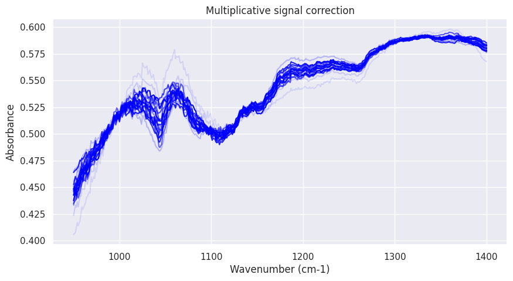


### __Standard normal variate__
Standard normal variate (SNV) is a preprocessing technique in spectroscopy that adjusts for baseline shifts and variations in signal intensity by subtracting the mean and dividing by the standard deviation of each spectrum.

Usage example for a single reference spectrum:

```python
from chemotools.scatter import StandardNormalVariate

snv = StandardNormalVariate()
spectra_snv = snv.fit_transform(spectra)
```
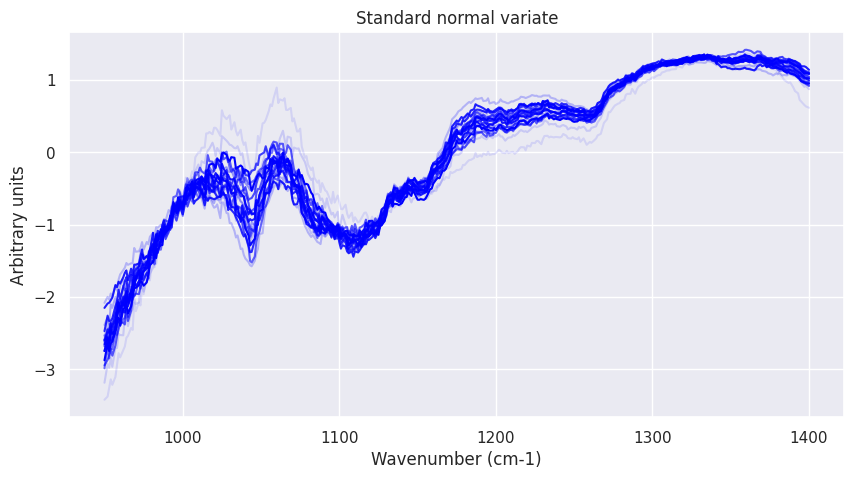


### __Extended multiplicative scatter correction__
Extended multiplicative scatter correction (EMSC) is a preprocessing technique in spectroscopy that corrects for the influence of light scattering and instrumental drift by fitting a mathematical model to a reference spectrum and using it to normalize all spectra in the dataset.

An implementation of the EMSC will be available soon 🤓.

## __Derivatives__

This package contains two common algorithms for calculating derivatives in spectroscopy:

- Savitzky-Golay derivative
- William Norris derivative

### __Savitzky-Golay derivative__
Savitzky-Golay derivative is a preprocessing technique in spectroscopy that calculates the derivative of a spectrum by fitting a polynomial to a window of adjacent points and calculating the derivative of the polynomial.

The following arguments can be set:

- ```window_size: int```: The length of the window. Must be an odd integer number. _Default: 5_.
- ```polynomial_order: int```: The order of the polynomial used to fit the samples. Must be less than ```window_size```. _Default: 2_.
- ```derivative_order: int```: The order of the derivative to compute. _Default: 1_.
- ```mode: str```: The mode of the boundary. _Default: 'nearest'_, available options: ```'nearest'```, ```'constant'```, ```'reflect'```, ```'wrap'```, ```'mirror'```, ```'interp'```. See https://docs.scipy.org/doc/scipy/reference/generated/scipy.signal.savgol_filter.html for more information.

Usage example:

```python
from chemotools.derivative import SavitzkyGolay

sg = SavitzkyGolay(window_size=15, polynomial_order=2, derivate_order=1)
spectra_derivative = sg.fit_transform(spectra)
```

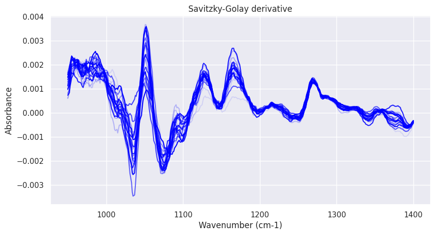

### __William Norris derivative__
William Norris derivative is a preprocessing technique in spectroscopy that calculates the derivative of a spectrum using finite differences.

The following arguments can be set:

- ```window_size: int```: The length of the window. Must be an odd integer number. _Default: 5_.
- ```gap_size: int```: The number of points between the first and second points of the window. _Default: 3_.
- ```derivative_order: int```: The order of the derivative to compute. _Default: 1_.
- ```mode: str```: The mode of the boundary. _Default: 'nearest'_, available options: ```‘reflect’```, ```‘constant’```, ```‘nearest’```, ```‘mirror’```, ```‘wrap’```. See https://docs.scipy.org/doc/scipy/reference/generated/scipy.ndimage.convolve.html for more information.

Usage example:

```python
from chemotools.derivative import NorrisWilliams

nw = NorrisWilliams(window_size=15, gap_size=3, derivative_order=1)
spectra_derivative =   nw.fit_transform(spectra)
```
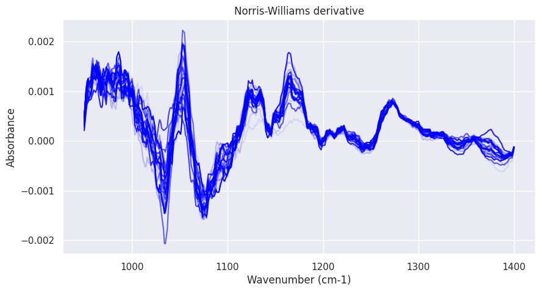

## __Baseline__
Baseline correction is a preprocessing technique in spectroscopy that corrects for baseline shifts and variations in signal intensity by subtracting a baseline from a spectrum. The following algorithms are available:

- Linear baseline correction
- Polynomial baseline correction
- Cubic spline baseline correction
- Alternate iterative reweighed penalized least squares (AIRPLS) baseline correction
- Non-negative

### __Linear baseline correction__
Linear baseline correction is a preprocessing technique in spectroscopy that corrects for baseline shifts and variations in signal intensity by subtracting a linear baseline from a spectrum. The current implementation subtracts a linear baseline between the first and last point of the spectrum.

Usage example:

```python
from chemotools.baseline import LinearCorrection

lc = LinearCorrection()
spectra_baseline = lc.fit_transform(spectra)
```
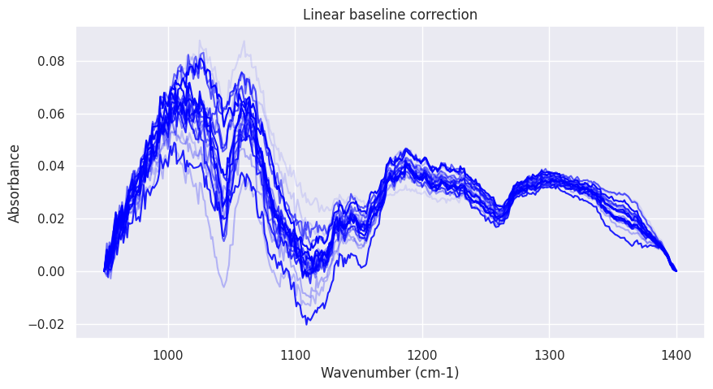


### __Polynomial baseline correction__
Polynomial baseline correction is a preprocessing technique in spectroscopy that approximates a baseline by fitting a polynomial to selected points of the spectrum. The selected points often correspond to minima in the spectra, and are selected by their index (not by the wavenumber). If no points are selected, the algorithm will select the first and last point of the spectrum.

The following arguments can be set:

- ```order: int``` The order of the polynomial used to fit the samples. _Default: 1_.
- ```indices: tuple``` The indices of the points to use for fitting the polynomial. _Default: (0, -1)_. At the moment the indices need to be specified manually as a tuple because ```scikit-learn``` does not support mutable attributes in ```BaseEstimator```. This tuple is transformed to a list when the ```transform``` method is called.

Usage example:

```python
from chemotools.baseline import PolynomialCorrection

pc = PolynomialCorrection(order=2, indices=(0, 75, 150, 200, 337))
spectra_baseline = pc.fit_transform(spectra)
```
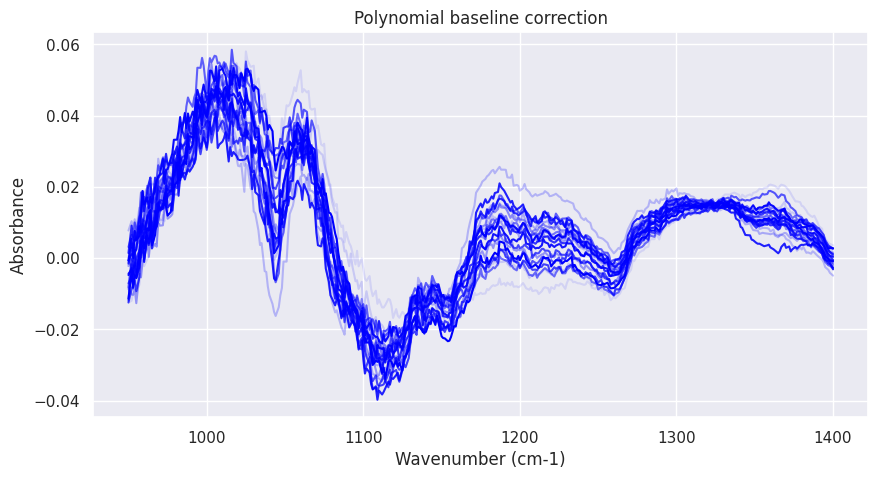

### __Cubic spline baseline correction__
Cubic spline baseline correction is a preprocessing technique in spectroscopy that approximates a baseline by fitting a cubic spline to selected points of the spectrum. Similar to the ```PolynomialCorrection```, the selected points often correspond to minima in the spectra, and are selected by their index (not by the wavenumber). If no points are selected, the algorithm will select the first and last point of the spectrum. 

The following arguments can be set:
- ```indices: tuple``` The indices of the points to use for fitting the polynomial. _Default: None_. At the moment the indices need to be specified manually as a tuple because ```scikit-learn``` does not support mutable attributes in ```BaseEstimator```. This tuple is transformed to a list when the ```transform``` method is called.

Usage example:

```python
from chemotools.baseline import CubicSplineCorrection

cspl = CubicSplineCorrection(indices=(0, 75, 150, 200, 337))
spectra_baseline = cspl.fit_transform(spectra)
```

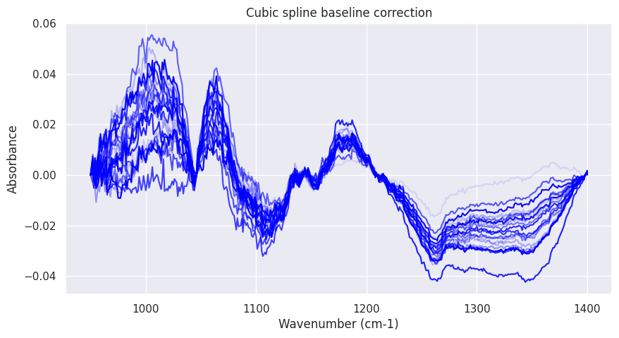

### __Alternate iterative reweighed penalized least squares (AIRPLS) baseline correction__
It is an automated baseline correction algorithm that uses a penalized least squares approach to fit a baseline to a spectrum. The original algorithm is based on the paper by [Zhang et al.](https://pubs.rsc.org/is/content/articlelanding/2010/an/b922045c). The current implementation is based on the Python implementation by [zmzhang](https://github.com/zmzhang/airPLS).

The following arguments can be set:
- ```nr_iterations: int``` The number of iterations before exiting the algorithm. _Default: 15_.
- ```lam: float``` smoothing factor. _Default: 1e2_.
- ```polynomial_order: int``` The order of the polynomial used to fit the samples. _Default: 1_.

Usage example:

```python
from chemotools.baseline import AirPls

airpls = AirPls()
spectra_baseline = airpls.fit_transform(spectra)
```

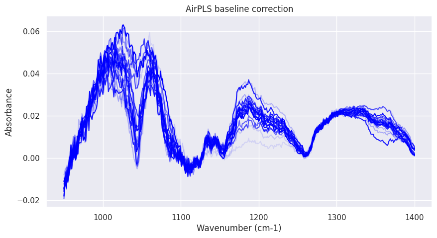

### __Non-negative__
Non-negative baseline correction is a preprocessing technique in spectroscopy that corrects for baseline by removing negative values from a spectrum. Negative values are either replaced by 0, or set to their absolute value.

The following arguments can be set:
- ```mode: str``` If ```'zero'```, negative values are replaced by 0. If ```'abs'```, negative values are set to their absolute value. _Default: ```'zero'```.

Usage example:

```python
from chemotools.baseline import NonNegative

nnz = NonNegative(mode='zero')
nna = NonNegative(mode='abs')
spectra_nnz = nnz.fit_transform(spectra_baseline)
spectra_nna = nna.fit_transform(spectra_baseline)
```

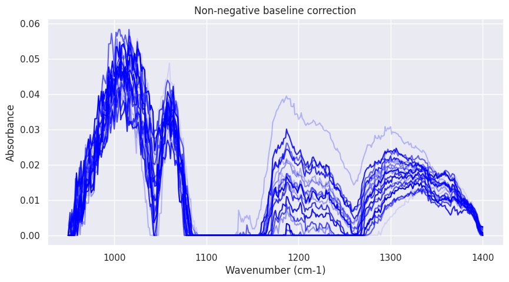
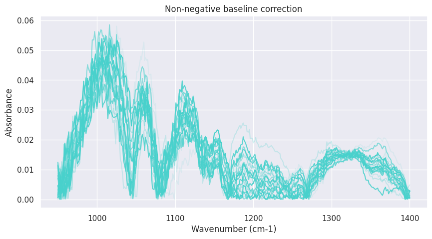

## __Scale__
Scale is a preprocessing technique in spectroscopy that scales the spectra. The following algorithms are available:
- MinMaxScaler: scales each spectrum by its minimum or maximum value.
- L-normalization: scales each spectrum by its L-norm.

### __MinMax scaler__
MinMaxScaler is a preprocessing technique in spectroscopy that scales each spectrum by its minimum or maximum value. 

The following arguments can be set:
- ```norm: str``` If ```'min'```, the spectrum is scaled by its minimum value. If ```'max'```, the spectrum is scaled by its maximum value. _Default: ```'max'```_.

Usage example:

```python
from chemotools.scale import MinMaxScaler

minmax = MinMaxScaler(norm='max')
spectra_norm = minmax.fit_transform(spectra)
```

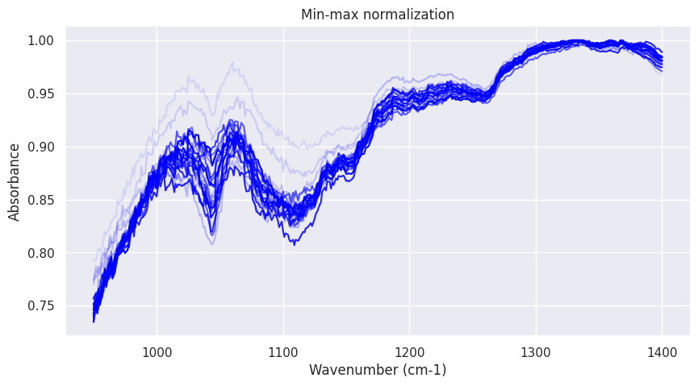


### __L-normalization__
L-normalization is a preprocessing technique in spectroscopy that scales each spectrum by its L-norm. 

The following arguments can be set:
- ```l-norm: int``` The L-norm to use. _Default: ```2```_.

Usage example:

```python
from chemotools.scale import LNormalize

lnorm = LNormalize(l_norm=2)
spectra_norm = lnorm.fit_transform(spectra)
```

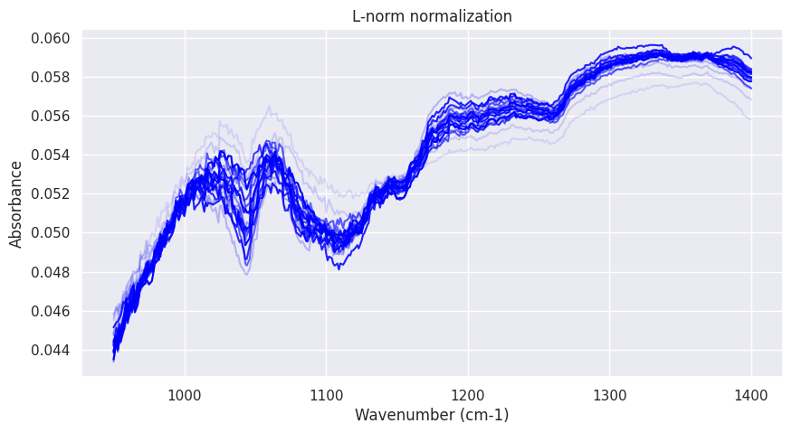

## __Smooth__
Smooth is a preprocessing technique in spectroscopy that smooths the spectra. The following algorithms are available:
- Savitzky-Golay filter
- Whittaker smoother
- Mean filter
- Median filter

### __Savitzky-Golay filter__
Savitzky-Golay filter is a preprocessing technique in spectroscopy that smooths the spectra by fitting a polynomial to the data. The current implementation is based on the ```scipy.signal.savgol_filter``` function.

The following arguments can be set:

- ```window_size: int```: The length of the window. Must be an odd integer number. _Default: 3_.
- ```polynomial_order: int```: The order of the polynomial used to fit the samples. Must be less than ```window_size```. _Default: 1_.
- ```derivative_order: int```: The order of the derivative to compute. _Default: 1_. ```'constant'```, ```'reflect'```, ```'wrap'```, ```'mirror'```, ```'interp'```. See https://docs.scipy.org/doc/scipy/reference/generated/scipy.signal.savgol_filter.html for more information.

Usage example:

```python
from chemotools.smooth import SavitzkyGolayFilter

sgf = SavitzkyGolayFilter(window_size=15, polynomial_order=2)
spectra_norm = sgf.fit_transform(spectra)
```

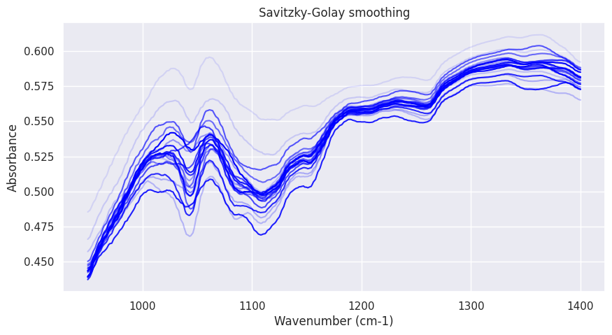

### __Whittaker smoother__
It is an automated smoothing algorithm that uses a penalized least squares approach to iteratively apply a smoothing operation to the data  by minimizing a penalty function that balances the degree of smoothness and the fidelity to the original data.

The following arguments can be set:
- ```lam: float``` smoothing factor. _Default: 1e2_.
- ```differences: int``` The number of differences to use. _Default: 1_.

Usage example:

```python
from chemotools.smooth import WhittakerSmooth

wtk = WhittakerSmooth(lam=10)
spectra_norm = wtk.fit_transform(spectra)
```

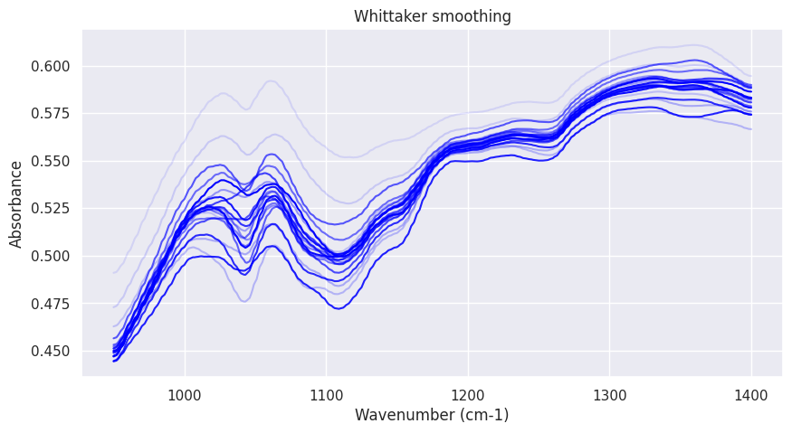

### __Mean filter__
Mean filter is a preprocessing technique in spectroscopy that smooths the spectra by applying a mean filter. The current implementation is based on the ```scipy.ndimage.uniform_filter``` function.

The following arguments can be set:
- ```window_size: int```: The length of the window. Must be an odd integer number. _Default: 3_.
- ```mode: str```: The mode parameter determines how the array borders are handled, where ```'constant'```, ```'reflect'```, ```'wrap'```, ```'mirror'```, ```'interp'```. See https://docs.scipy.org/doc/scipy/reference/generated/scipy.ndimage.uniform_filter1d.html for more information. _Default: ```'nearest'```_.

Usage example:

```python
from chemotools.smooth import MeanFilter

mean_filter = MeanFilter()
spectra_norm = mean_filter.fit_transform(spectra)
```


### __Median filter__
Median filter is a preprocessing technique in spectroscopy that smooths the spectra by applying a median filter. The current implementation is based on the ```scipy.ndimage.median_filter``` function.

The following arguments can be set:
- ```window_size: int```: The length of the window. Must be an odd integer number. _Default: 3_.
- ```mode: str```: The mode parameter determines how the array borders are handled, where ```'constant'```, ```'reflect'```, ```'wrap'```, ```'mirror'```, ```'interp'```. See https://docs.scipy.org/doc/scipy/reference/generated/scipy.ndimage.median_filter.html for more information. _Default: ```'nearest'```_.

Usage example:

```python
from chemotools.smooth import MedianFilter

median_filter = MedianFilter()
spectra_norm = median_filter.fit_transform(spectra)
```

