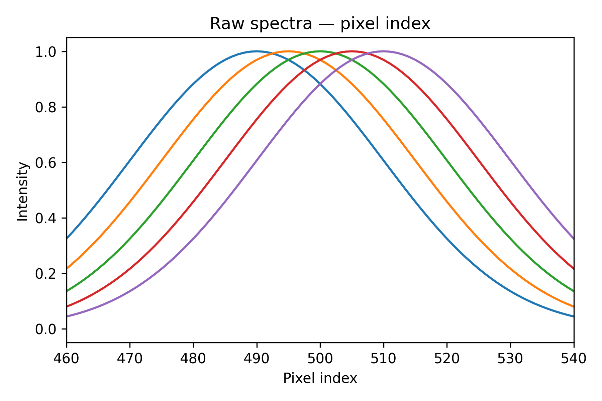
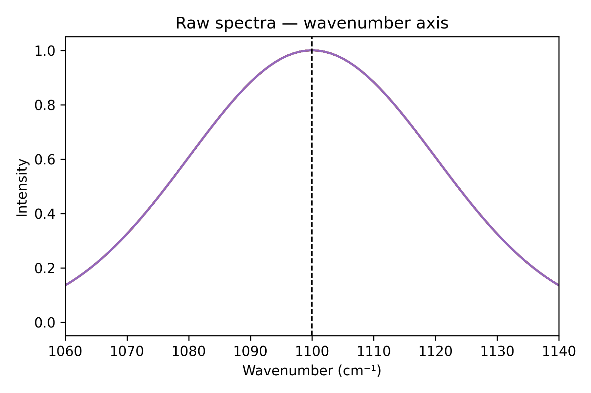
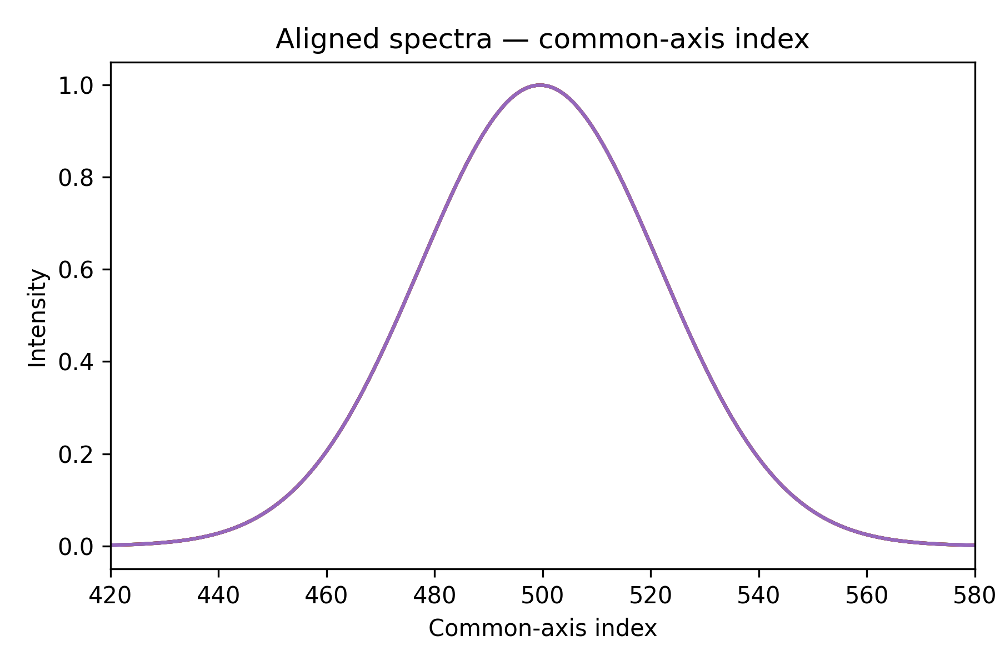

.. _dynamic_transformers:

Dynamic transformers
====================

In conventional chemometrics practice, preprocessing is treated as a
**static** operation: a correction is determined from a calibration set and
then applied uniformly to every new spectrum. The preprocessing step holds
everything it needs — a stored mean spectrum, a fitted baseline, a set of
PLS loadings — and the data alone is sufficient at prediction time.

This works well for a large class of problems, but it breaks down when the
correction you need to apply depends on **information that is only available
at inference time**. In practice this information falls into two categories:

* **Measurement metadata** — instrument-level quantities recorded alongside
  the spectrum but not part of it: the x-axis calibration, laser power,
  integration time, detector temperature.
* **Process data** — sample- or batch-level context that changes between
  runs or samples: a fresh background measurement, a dilution factor, a reference
  standard collected just before the sample or other process parameters such as 
  temperature or humidity.

Some concrete examples from spectroscopy:

* The **x-axis grid** of the instrument drifted between calibration and
  deployment. Each new spectrum arrives on a slightly different wavenumber
  array.
* You want to **normalize by laser power** or integration time, values that
  are logged per measurement but are not part of the spectrum itself.
* A **background spectrum** is measured fresh before each sample batch and
  must be subtracted at inference, not at fit time.

``chemotools`` addresses this with a set of *dynamic transformers*: estimators
that accept additional **per-call parameters** alongside ``X`` at transform
time, delivered through `scikit-learn's metadata routing framework
<https://scikit-learn.org/stable/metadata_routing.html>`_.

.. list-table:: Dynamic transformers in ``chemotools``
   :widths: 30 25 45
   :header-rows: 1

   * - Transformer
     - Metadata
     - Choose it when
   * - :class:`~chemotools.adaptation.XAxisInterpolator`
     - ``x_axis``
     - Spectra must be resampled from changing input grids onto one fixed grid.
   * - :class:`~chemotools.adaptation.MetadataFunctionTransformer`
     - User-defined names
     - A custom correction needs one or more values that change between calls.

The distinction is useful: :class:`~chemotools.adaptation.XAxisInterpolator`
is a specialized, fully validated interpolation estimator, while
:class:`~chemotools.adaptation.MetadataFunctionTransformer` adapts a regular
Python function to scikit-learn's estimator and metadata-routing interfaces.
Use the specialized transformer for x-axis alignment. Use the function wrapper
for operations such as reference subtraction, intensity scaling, offsets, or
domain-specific corrections.

XAxisInterpolator: align spectra to a common grid
--------------------------------------------------

In Raman spectroscopy, each instrument has a slightly different
pixel-to-wavenumber calibration. Spectra from different instruments share the
same chemistry but arrive on different x-axis grids — so they cannot be
stacked into a matrix until they are resampled onto a common one.

Five simulated spectra, each with a Gaussian peak at 1100 cm⁻¹ but on a
slightly different grid, illustrate the problem.

**Setting up the data**

.. code-block:: python

    import numpy as np
    import sklearn
    import matplotlib.pyplot as plt
    from chemotools.adaptation import XAxisInterpolator

    sklearn.set_config(enable_metadata_routing=True)  # explained in "How metadata routing works" below

    N       = 1000                   # pixels per spectrum
    sigma   = 20                     # peak width (pixels)
    offsets = [-10, -5, 0, 5, 10]   # pixel-grid offset per instrument

    raw_spectra, raw_x_axes = [], []

    for offset in offsets:
        peak = N // 2 + offset
        y = np.exp(-0.5 * ((np.arange(N) - peak) / sigma) ** 2)
        x = np.arange(N) + (1100 - peak)      # x[peak] == 1100 wn
        raw_spectra.append(y)
        raw_x_axes.append(x)

    raw_spectra = np.array(raw_spectra)   # shape (5, 1000)
    raw_x_axes  = np.array(raw_x_axes)    # shape (5, 1000)

**Step 1 — what the instrument gives you**

Each spectrum is delivered as an array of intensity values indexed by pixel
number. When you plot them on a common pixel axis, the peaks appear at
different positions — each instrument's zero point is slightly different.

.. code-block:: python

    zoom = 40

    fig, ax = plt.subplots(figsize=(6, 4))
    for y in raw_spectra:
        ax.plot(y)
    ax.set_xlim(N // 2 - zoom, N // 2 + zoom)
    ax.set(title="Raw spectra — pixel index", xlabel="Pixel index", ylabel="Intensity")
    plt.tight_layout()
    plt.show()

|

Peaks land at different pixel positions — the grids are misaligned. If you
stacked these rows into a matrix as-is and fed it to a PLS model, column *k*
would represent a different wavenumber for each instrument, so every learned
regression coefficient would point at the wrong feature.

**Step 2 — plot against wavenumber**

Each spectrum comes with its own wavenumber axis. Plotting against it shows
the peaks coincide at 1100 cm⁻¹, but the arrays are still all different.

.. code-block:: python

    fig, ax = plt.subplots(figsize=(6, 4))
    for y, x in zip(raw_spectra, raw_x_axes):
        ax.plot(x, y)
    ax.axvline(1100, color="k", linestyle="--", linewidth=1)
    ax.set_xlim(1100 - zoom, 1100 + zoom)
    ax.set(title="Raw spectra — wavenumber axis", xlabel="Wavenumber (cm⁻¹)", ylabel="Intensity")
    plt.tight_layout()
    plt.show()

|

**Step 3 — interpolate onto a common grid**

:class:`~chemotools.adaptation.XAxisInterpolator` takes a ``common_x_axis``
defined once at construction time and, at every ``transform`` call, resamples
each row from its own ``x_axis`` onto that shared grid. The per-spectrum
axis is passed as metadata — not baked into the transformer — so it can
change freely between calls.

.. code-block:: python

    x_common = np.linspace(650, 1550, N)

    interpolator = (
        XAxisInterpolator(
            common_x_axis=x_common, method="linear", left=0, right=0
        )  # left/right fill values outside the grid
        .set_fit_request(x_axis=True)
        .set_transform_request(x_axis=True)
    )

    aligned_spectra = interpolator.fit_transform(raw_spectra, x_axis=raw_x_axes)

.. code-block:: python

    fig, ax = plt.subplots(figsize=(6, 4))
    for y in aligned_spectra:
        ax.plot(y)
    ax.set(
        title="Aligned spectra — common-axis index",
        xlabel="Common-axis index",
        ylabel="Intensity",
    )
    plt.tight_layout()
    ax.set_xlim(420, 580)
    plt.show()

|

All five peaks now sit at the same column index. The matrix ``aligned_spectra``
can be fed directly into any subsequent step or model.

Route ``x_axis`` through a Pipeline
-----------------------------------

The two method calls on the interpolator — ``set_fit_request(x_axis=True)``
and ``set_transform_request(x_axis=True)`` — register ``x_axis`` as a
metadata argument for the ``fit`` and ``transform`` phases respectively.
When you pass ``x_axis`` to a pipeline call, scikit-learn delivers it only
to the step that declared it; every other step is unaffected.

``set_fit_request`` covers ``fit`` and ``fit_transform``;
``set_transform_request`` covers ``transform``. Both are declared in the
example because a :class:`~sklearn.pipeline.Pipeline` calling
``fit_transform`` routes metadata through both phases.

Using it inside a Pipeline
---------------------------

The pipeline below continues from the same variables defined above:

.. code-block:: python

    from sklearn.pipeline import Pipeline
    from sklearn.preprocessing import StandardScaler
    from chemotools.scatter import MultiplicativeScatterCorrection

    pipe = Pipeline(
        [
            (
                "interpolate",
                XAxisInterpolator(
                    common_x_axis=x_common, method="linear", left=0, right=0
                )  # left/right fill values outside the grid
                .set_fit_request(x_axis=True)
                .set_transform_request(x_axis=True),
            ),
            ("msc", MultiplicativeScatterCorrection()),
            ("scaler", StandardScaler()),
        ]
    )

    # x_axis is routed to "interpolate" only; the other steps never see it
    X_preprocessed = pipe.fit_transform(raw_spectra, x_axis=raw_x_axes)

.. note::

   Only the step that declared ``set_transform_request(x_axis=True)`` receives
   ``x_axis``. The other steps in the pipeline are unaffected.

Shared vs. per-sample grids
-----------------------------

Not every batch comes from multiple instruments. When all spectra in a call
share the same grid, you can pass a single 1-D array instead of a matrix.
``x_axis`` accepts two shapes:

* **Shape** ``(n_features,)`` — the same grid for every spectrum in the
  call. Use this when all spectra in a batch come from the same instrument
  (e.g., a single measurement session where the grid is fixed).

* **Shape** ``(n_samples, n_features)`` — one grid per row. Use this when
  combining spectra from multiple instruments in one batch (as in the
  example above, where each of the five spectra has its own offset).

.. code-block:: python

    # Shared grid — all spectra measured on the same instrument axis
    x_shared = raw_x_axes[0]                          # shape (1000,)
    X_aligned_shared = interpolator.transform(raw_spectra, x_axis=x_shared)

    # Per-sample grids — each spectrum has its own axis
    X_aligned_per = interpolator.transform(raw_spectra, x_axis=raw_x_axes)  # shape (5, 1000)

Interpolation methods
----------------------

:class:`~chemotools.adaptation.XAxisInterpolator` supports three methods,
selectable via the ``method`` parameter:

.. list-table::
   :widths: 15 55 30
   :header-rows: 1

   * - ``method``
     - Description
     - When to use
   * - ``"linear"``
     - Piecewise linear interpolation.
     - Fast; best when spectra are smooth and grids are closely spaced.
   * - ``"cubic"``
     - Natural cubic spline (via :func:`scipy.interpolate.CubicSpline`).
     - Good all-round choice; smooth and accurate.
   * - ``"pchip"``
     - Piecewise cubic Hermite (via :func:`scipy.interpolate.PchipInterpolator`).
     - Preserves monotonicity; avoids overshooting near peaks.

Points outside the input grid are filled with ``left`` / ``right`` (both
default to :data:`numpy.nan`). You can change these to ``0.0`` or any other
sentinel value if your downstream steps cannot handle ``NaN``.

MetadataFunctionTransformer: build a dynamic correction
--------------------------------------------------------

:class:`~chemotools.adaptation.MetadataFunctionTransformer` turns a Python
function into a scikit-learn transformer that can receive named metadata. It is
useful when the mathematical operation is simple, but one or more operands are
only known when a batch is transformed.

Consider background subtraction. A new reference spectrum is collected before
each measurement batch, so it cannot be stored permanently when the model is
trained. The operation itself is only ``X - reference``. The wrapper supplies
the estimator interface and routes ``reference`` to that operation at the right
time.

The three pieces
~~~~~~~~~~~~~~~~

Every metadata function transformer has three parts:

.. list-table:: The MetadataFunctionTransformer contract
   :widths: 25 35 40
   :header-rows: 1

   * - Part
     - Example
     - Meaning
   * - Feature matrix
     - ``X``
     - The first positional argument passed to the function.
   * - Metadata names
     - ``("reference",)``
     - Keyword arguments that the transformer requests and forwards.
   * - Metadata values
     - ``reference=background``
     - Values supplied separately on each transformation call.

The names must agree exactly:

.. code-block:: python

    def subtract_reference(X, reference):
        return X - reference

    transformer = MetadataFunctionTransformer(
        func=subtract_reference,
        metadata=("reference",),
    )

``reference`` appears once in the function signature and once in the
``metadata`` tuple. Its value is supplied later:

.. code-block:: python

    X_corrected = transformer.fit_transform(X, reference=background)

The trailing comma in ``("reference",)`` matters: it creates a one-item tuple.
The names ``"X"`` and ``"y"`` cannot be used because they are reserved by the
scikit-learn estimator API.

Start with a predefined function
~~~~~~~~~~~~~~~~~~~~~~~~~~~~~~~~

``chemotools`` includes common, picklable functions in
:mod:`chemotools.adaptation.functions`. Using one of these is the shortest path
to a dynamic correction:

.. code-block:: python

    import numpy as np
    from chemotools.adaptation import MetadataFunctionTransformer
    from chemotools.adaptation.functions import subtract_reference

    X = np.array(
        [
            [1.0, 2.0, 3.0],
            [4.0, 5.0, 6.0],
        ]
    )
    background = np.array([[0.2, 0.3, 0.4]])

    subtract_background = MetadataFunctionTransformer(
        func=subtract_reference,
        metadata=("reference",),
    )

    X_corrected = subtract_background.fit_transform(
        X,
        reference=background,
    )

    # array([[0.8, 1.7, 2.6],
    #        [3.8, 4.7, 5.6]])

The predefined functions cover four common element-wise corrections:

.. list-table:: Predefined metadata functions
   :widths: 30 25 45
   :header-rows: 1

   * - Function
     - Metadata name
     - Operation
   * - :func:`~chemotools.adaptation.functions.subtract_reference`
     - ``reference``
     - ``X - reference``
   * - :func:`~chemotools.adaptation.functions.divide_by_reference`
     - ``reference``
     - ``X / reference``
   * - :func:`~chemotools.adaptation.functions.scale_by_factor`
     - ``factor``
     - ``X * factor``
   * - :func:`~chemotools.adaptation.functions.add_offset`
     - ``offset``
     - ``X + offset``

Understand metadata shapes
~~~~~~~~~~~~~~~~~~~~~~~~~~

The predefined functions use NumPy broadcasting. The metadata shape determines
whether a correction is global, shared by a batch, or different for each
sample.

For an input ``X`` with shape ``(n_samples, n_features)``, accepted metadata
shapes are:

.. list-table:: Metadata broadcasting patterns
   :widths: 25 35 40
   :header-rows: 1

   * - Shape
     - Interpretation
     - Typical use
   * - Scalar
     - One value for every element
     - A global calibration factor
   * - ``(1, n_features)``
     - One value per feature, shared by all samples
     - A background spectrum for the batch
   * - ``(n_samples, 1)``
     - One value per sample, shared across its features
     - Integration time or dilution factor
   * - ``(n_samples, n_features)``
     - One value per element
     - A sample-specific reference spectrum

One-dimensional metadata is deliberately rejected by the predefined functions
because its meaning is ambiguous when ``n_samples == n_features``. Reshape it
explicitly:

.. code-block:: python

    # One factor for each sample
    factor_per_sample = factor_1d.reshape(-1, 1)

    # One reference value for each feature
    reference_per_feature = reference_1d.reshape(1, -1)

Custom functions decide which metadata types and shapes they support. The
wrapper routes values; it does not interpret or reshape them.

Write a custom function
~~~~~~~~~~~~~~~~~~~~~~~

A compatible function follows a small contract:

* ``X`` is its first positional argument.
* Routed values are named parameters that can be passed by keyword.
* Every required parameter after ``X`` is listed in ``metadata``.
* It returns a finite, numeric, two-dimensional array.
* It preserves the number of samples and, for this transformer, the number of
  features.

For example, this correction combines a per-sample integration time with an
optional dark-current offset:

.. code-block:: python

    def correct_acquisition(X, integration_time, dark_offset=0.0):
        return (X - dark_offset) / integration_time

    correction = MetadataFunctionTransformer(
        func=correct_acquisition,
        metadata=("integration_time", "dark_offset"),
    )

    integration_time = np.array([[1.0], [2.0]])
    dark_offset = np.array([[0.05, 0.04, 0.06]])

    X_corrected = correction.fit_transform(
        X,
        integration_time=integration_time,
        dark_offset=dark_offset,
    )

Optional function parameters may still be listed in ``metadata``. If no value
is supplied during a direct ``transform`` call, the function's default is used.
Additional values passed to the transformer but not listed in ``metadata`` are
not forwarded.

Avoid positional-only metadata parameters because metadata is always forwarded
by name. In the following function, ``reference`` cannot be routed:

.. code-block:: python

    def incompatible(X, reference, /):
        return X - reference

Functions defined at module level are preferable to lambdas or nested functions
when the fitted pipeline will be serialized. Standard pickle-based tools need
to import the function by its module and name when loading the pipeline.

Validate a custom function before wrapping it
~~~~~~~~~~~~~~~~~~~~~~~~~~~~~~~~~~~~~~~~~~~~~

The transformer checks the function signature during ``fit`` without executing
the function. Value-dependent problems, such as an invalid metadata shape or a
one-dimensional result, cannot be discovered from the signature alone.

Use :func:`~chemotools.adaptation.validation.check_metadata_function` with
representative data to exercise the complete function contract eagerly:

.. code-block:: python

    from chemotools.adaptation.validation import check_metadata_function

    checked_output = check_metadata_function(
        correct_acquisition,
        X,
        metadata={
            "integration_time": integration_time,
            "dark_offset": dark_offset,
        },
    )

This call performs the following checks:

#. ``X`` is finite, numeric, and two-dimensional.
#. The function can be called as ``func(X, **metadata)``.
#. The function executes successfully on the representative values.
#. Its output is finite, numeric, and two-dimensional.
#. Its output preserves the number of samples and features.

The helper returns the validated output so the custom function is executed only
once. It is intended for development, testing, and validation of a new
function. It is not automatically run inside every ``transform`` call.

.. warning::

   ``check_metadata_function`` executes user-provided code. Exceptions and side
   effects from the function are not suppressed.

If a custom operation intentionally changes the number of features, pass
``preserve_features=False`` to the checker. Such a function does not satisfy
the same-shape contract documented by
:class:`~chemotools.adaptation.MetadataFunctionTransformer`, so use that option
only when the downstream interface and feature naming are handled explicitly.

Use MetadataFunctionTransformer in a Pipeline
~~~~~~~~~~~~~~~~~~~~~~~~~~~~~~~~~~~~~~~~~~~~~

Enable metadata routing before passing additional values through a
:class:`~sklearn.pipeline.Pipeline`:

.. code-block:: python

    from sklearn import set_config
    from sklearn.pipeline import Pipeline
    from sklearn.preprocessing import StandardScaler

    set_config(enable_metadata_routing=True)

    pipeline = Pipeline(
        [
            (
                "subtract_background",
                MetadataFunctionTransformer(
                    func=subtract_reference,
                    metadata=("reference",),
                ),
            ),
            ("scale", StandardScaler()),
        ]
    )

    X_ready = pipeline.fit_transform(X, reference=background)

Unlike :class:`~chemotools.adaptation.XAxisInterpolator`, the function wrapper
does not require calls to ``set_fit_request`` or ``set_transform_request``.
It registers every name in ``metadata`` automatically. In this example,
``reference`` is routed to ``subtract_background`` and is not sent to
``StandardScaler``.

After fitting, a new reference can be supplied for each prediction batch:

.. code-block:: python

    background_next = np.array([[0.3, 0.2, 0.4]])
    X_next_ready = pipeline.transform(
        X_next,
        reference=background_next,
    )

Metadata routing must be enabled for Pipeline calls, but it is not needed when
calling ``fit_transform`` or ``transform`` directly on the transformer.

What happens during fit and transform
~~~~~~~~~~~~~~~~~~~~~~~~~~~~~~~~~~~~~

The transformer deliberately separates structural checks from execution:

.. list-table:: Transformer lifecycle
   :widths: 20 40 40
   :header-rows: 1

   * - Method
     - What it validates
     - What it does with metadata
   * - ``fit``
     - Parameters, ``X``, and the callable signature
     - Registers names but does not execute ``func``
   * - ``transform``
     - ``X`` and fitted state
     - Forwards listed values and executes ``func`` once
   * - ``fit_transform``
     - Performs both phases
     - Makes metadata available to the transformation phase

Not executing the function during ``fit`` avoids duplicate work and unexpected
side effects. It also reflects the central use case: metadata values available
during deployment may differ from those seen while the pipeline is fitted.

With the default ``validate=True``, ``X`` is converted to a finite numeric
two-dimensional array and its feature count is checked against the fitted
input. Set ``validate=False`` only when the function must receive another data
container unchanged and performs its own input validation. Output validation is
always the responsibility of the function.

Common errors and how to fix them
~~~~~~~~~~~~~~~~~~~~~~~~~~~~~~~~~

.. list-table:: Troubleshooting MetadataFunctionTransformer
   :widths: 35 30 35
   :header-rows: 1

   * - Symptom
     - Likely cause
     - Fix
   * - Required argument is missing from ``metadata``
     - The function needs a named value that the transformer does not request
     - Add its name to the ``metadata`` tuple
   * - Function does not accept a requested argument
     - A metadata name does not match the function signature
     - Correct the spelling or change the function parameter
   * - Missing positional argument during ``transform``
     - A requested value was not supplied for that call
     - Pass ``name=value`` to ``transform`` or the Pipeline method
   * - Positional-only parameter error
     - The function uses ``/`` after a metadata parameter
     - Make the metadata parameter keyword-compatible
   * - Metadata must contain strings or unique names
     - The ``metadata`` declaration is malformed
     - Use one unique string for each routed function argument
   * - ``y`` cannot be requested
    - ``X`` and ``y`` are reserved by the estimator API
     - Choose a domain-specific name such as ``target_reference``
   * - Expected a 2-D array
     - ``X``, output, or predefined-function metadata is one-dimensional
     - Reshape explicitly according to its sample or feature meaning
   * - Unexpected keyword in a Pipeline call
     - Metadata routing is disabled
     - Call ``set_config(enable_metadata_routing=True)``

Choose the right dynamic transformer
------------------------------------

Use :class:`~chemotools.adaptation.XAxisInterpolator` when the operation is
specifically interpolation from a changing source axis to a fixed target axis.
It validates monotonic grids, supports multiple interpolation methods, exposes
output feature names, and can process rows in parallel.

Use :class:`~chemotools.adaptation.MetadataFunctionTransformer` when the
operation is naturally expressed as a function of ``X`` and one or more
per-call values. Before placing a custom function in a production pipeline:

#. Give every routed value a clear, unique parameter name.
#. Test shared and per-sample metadata shapes relevant to the application.
#. Run :func:`~chemotools.adaptation.validation.check_metadata_function` on
   representative inputs.
#. Test the wrapped function through ``fit_transform`` and ``transform``.
#. Use a module-level named function if the pipeline will be serialized.
#. Exercise the complete Pipeline with metadata routing enabled.

Together, these two estimators support pipelines that remain reusable when
important correction inputs are not known until measurement or prediction
time.

.. seealso::

   * :doc:`XAxisInterpolator <../methods/generated/chemotools.adaptation.XAxisInterpolator>`
   * :doc:`MetadataFunctionTransformer <../methods/generated/chemotools.adaptation.MetadataFunctionTransformer>`
   * :doc:`check_metadata_function <../methods/generated/chemotools.adaptation.validation.check_metadata_function>`

