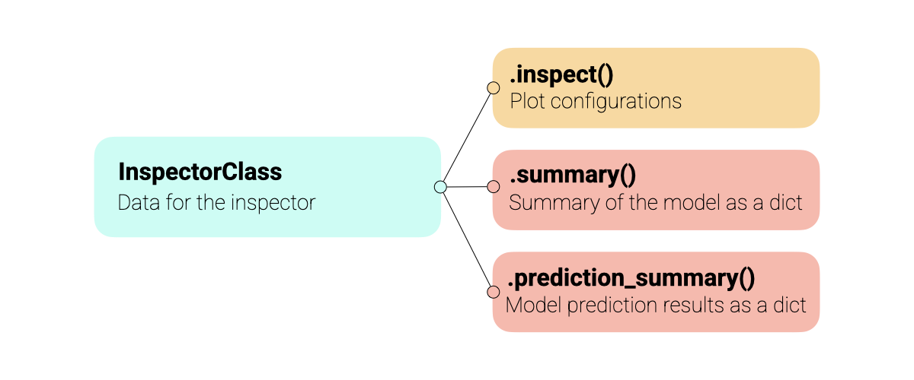
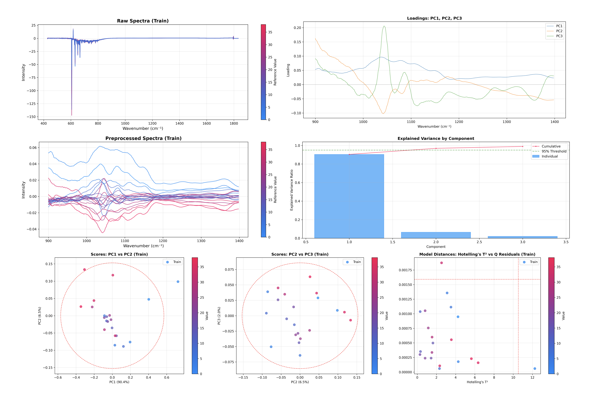
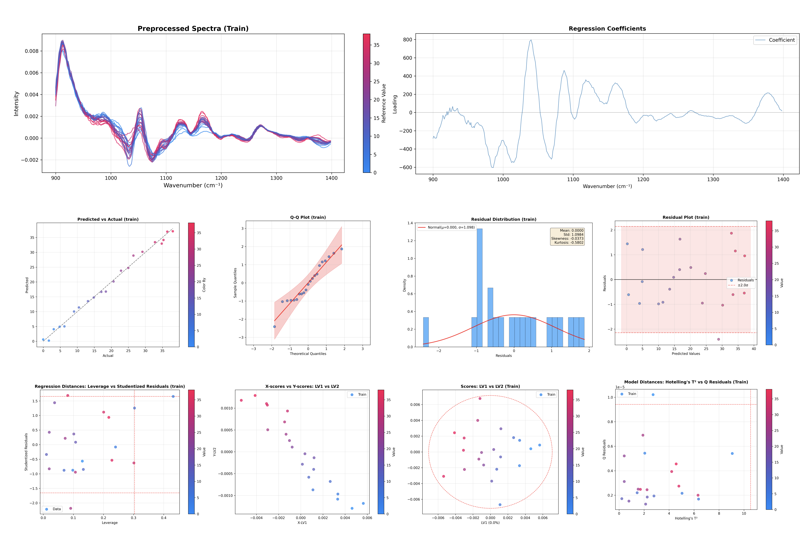
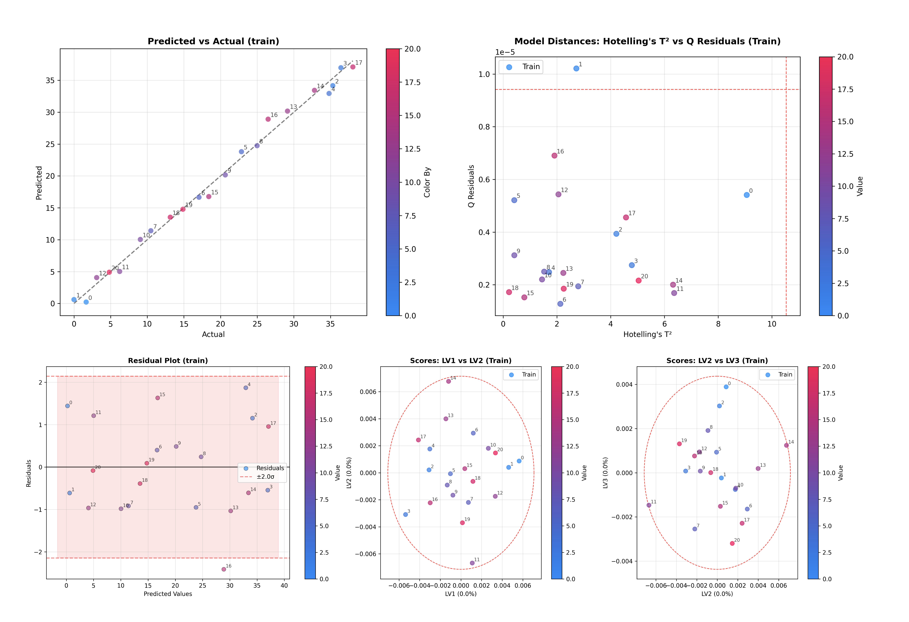
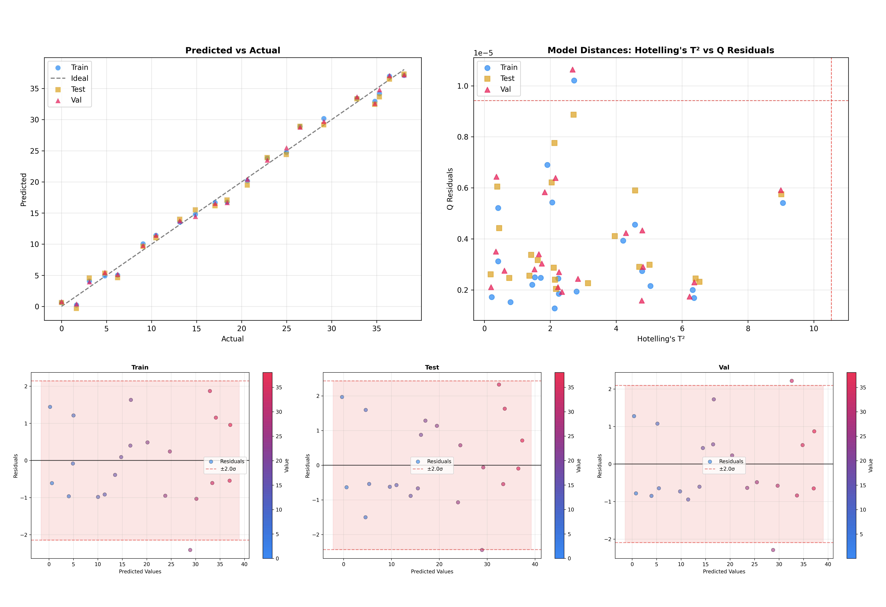

.. _inspector_fundamentals:

Inspecting your models
======================

The ``chemotools.inspector`` module provides a unified interface for model diagnostics. Instead of manually creating separate plots for scores, loadings, and outliers, the **Inspector** generates a complete diagnostic suite with a single method call.

All inspectors share the same API, making it intuitive to use across different model types (PCA, PLS, etc.). The inspectors support multiple datasets (training, test, validation) and offer extensive customization options for coloring, annotations, and component selection. An abstract overview of the inspectors is shown in the Figure below.

.. warning::
    The plotting module is experimental and under active development. The API may change in future versions. We welcome your feedback! Please report issues or suggestions at: https://github.com/paucablop/chemotools/issues

Why use the Inspector?
----------------------

Reduce boilerplate code, make your model flows more readable and ensure to fully understand your models:

*   **One-Liner Diagnostics**: Generate all standard plots (Scores, Loadings, Variance, Outliers) with ``.inspect()``.
*   **Unified Interface**: Consistent API for PCA and PLS models.
*   **Multi-Dataset Support**: Easily compare Training, Test, and Validation sets on the same plots.
*   **Interactive & Publication Ready**: Returns standard matplotlib figures that can be further customized.

Basic Usage
-----------

Currently, ``chemotools`` supports inspectors for:

*   **PCA**: ``chemotools.inspector.PCAInspector``
*   **PLS Regression**: ``chemotools.inspector.PLSRegressionInspector``

For the example, let's load some data and train a PCA and a PLS regression model.

.. code-block:: python

    from sklearn.cross_decomposition import PLSRegression
    from chemotools.datasets import load_fermentation_train
    from chemotools.inspector import PCAInspector, PLSRegressionInspector
    from sklearn.decomposition import PCA
    from sklearn.pipeline import make_pipeline
    from sklearn.preprocessing import StandardScaler

    # 1. Load Data
    X, y = load_fermentation_train()
    wn = X.columns 

    # 2. Fit the PCA Model
    pca = make_pipeline(
        RangeCut(start=900, end=1400, wavenumbers=wn),
        SavitzkyGolay(window_size=21, polynomial_order=2, derivate_order=0),
        StandardScaler(with_std=False),
        PCA(n_components=3),
    )
    pca.fit(X)

    # 3. Fit the PLS regression model

    pls = make_pipeline(
        RangeCut(start=900, end=1400, wavenumbers=wn),
        SavitzkyGolay(window_size=21, polynomial_order=2, derivate_order=1),
        PLSRegression(n_components=3, scale=False),
    )
    pls.fit(X, y)

Now that we have trained the models, we can inspect them using ``inspector``.  The core of the module is the ``.inspect()`` method, shared by all inspectors.

.. note::
    The ``inspect()`` method returns a dictionary of ``matplotlib.figure.Figure`` objects, allowing you to save or modify them individually.

Inspecting PCA Models
~~~~~~~~~~~~~~~~~~~~~~~~~~

First we take a look a tthe PCA model.

.. code-block:: python

    # 3. Inspect the PCA model
    inspector = PCAInspector(pca, X_train=X, y_train=y).inspect()

This single command generates and displays several key diagnostic plots:

*  **Explained Variance**: Helps you decide if you have enough components.
*  **Scores Plot**: Visualizes the sample space (PC1 vs PC2).
*  **Loadings Plot**: Visualizes the feature space (what the model is looking at).
*  **Outlier Detection**: Hotelling's T² vs Q-Residuals plot.

Inspecting PLS Regression Models
~~~~~~~~~~~~~~~~~~~~~~~~~~~~~~~~~~~

The PLS Regression inspector shares the same API as the PCAInspector, making it easy to switch between them.

.. code-block:: python

    # 4. Inspect the PLS Regression model
    inspector = PLSRegressionInspector(pls, X_train=X, y_train=y).inspect()

This command generates similar diagnostic plots, tailored for PLS regression:

*   **Explained Variance**: For both X and y (when available).
*   **Scores Plot**: Visualizes the sample space (LV1 vs LV2).
*   **Loadings Plot**: Visualizes the feature space.
*   **Outlier Detection**: Hotelling's T² vs Q-Residuals plot.
*   **Y Predictions vs True Values**: To assess regression performance.
*   **Y Residuals Plot**: To identify patterns in prediction errors.
*   **Q-Q Plot of Residuals**: To check normality of residuals.
*   **Y Residuals Histogram**: To visualize the distribution of residuals.

Customizing the Inspection
--------------------------

The ``inspect()`` method is highly customizable. You can control which components to plot, how to color the samples, and which datasets to include.

**1. Selecting Components**

You can specify which components to visualize in the scores and loadings plots.

.. code-block:: python

    # Plot PC2 vs PC3 for scores, and only the first component for loadings
    inspector.inspect(
        components_scores=(1, 2),
        loadings_components=0
    )

**2. Coloring and Annotations**

By default, plots are colored by the target variable ``y`` (if provided). You can customize this behavior using the ``color_by`` and ``annotate_by`` parameters. Both parameters accept:

- A string ``y`` to color by the target variable.
- A string ``sample_index`` to color/annotate by sample indices.
- A custom array-like of the same length as the number of samples (for single dataset).
- A dictionary mapping dataset names to arrays (for multi-dataset). Example: ``{'train': array1, 'test': array2}``.

Below we explore coloring by ``y`` and annotating by sample index.

.. code-block:: python

    # Color by y and annotate by sample index to see specific trends
    inspector.inspect(color_by='y', annotate_by='sample_index')

An examle of *some* of the plots provided by the ``PLSRegressionInspector`` colored by ``y`` and annotated by sample index is shown in the image below.

**3. Comparing Datasets (Train vs Test vs Validation)**

Another useful feature is the ability to overlay multiple datasets. This is critical to check how well does the model generalizes in unseen datasets.

.. code-block:: python

    # Initialize inspector with both train, test and validation data
    inspector = PLSRegressionInspector(
        pipeline, 
        X_train=X, 
        y_train=y,
        X_test=X_test, 
        y_test=y_test,
        X_val=X_val, 
        y_val=y_val
    )

    # Inspect all datasets together
    inspector.inspect(dataset=['train', 'test', 'val'])

This will produce plots where training, test, and validation samples are visualized together, making it easy to spot domain shifts or overfitting. An example of *some* of the plots provided by the ``PLSRegressionInspector`` is shown in the image below.

Summarize the models
-------------------------

Besides plotting, the inspectors also provide summary statistics of the models, which can be accessed via the ``.summary()`` and ``.prediction_summary()`` methods.

Summary of the model
~~~~~~~~~~~~~~~~~~~~~~~

.. code-block:: python

    # Get model summary
    inspector.summary()

This produced a dictionary with key information about the model:

.. code-block:: python

    {
    'model_type': 'PLSRegression',
    'has_preprocessing': True,
    'nr_features': 1047,
    'nr_components': 3,
    'nr_samples': {'train': 21, 'test': 21, 'val': 21},
    'preprocessing_steps': [
        {'step': 1, 'name': 'rangecut', 'type': 'RangeCut'},
        {'step': 2, 'name': 'savitzkygolay', 'type': 'SavitzkyGolay'}
        ],
    'RMSE': {
        'train': 1.0719752005764764,
        'test': 1.2090598004800035,
        'val': 1.137874989991219
        },
    'R2': {
        'train': 0.9921925924396554,
        'test': 0.9900682413886674,
        'val': 0.9912030903118407
        }
    }

Summary of the predictions
~~~~~~~~~~~~~~~~~~~~~~~~~~~~

.. code-block:: python

    # Get prediction summary
    inspector.prediction_summary()

This produced a dictionary with key statistics about the predictions. This dictionary can be visualized in a ``pandas.DataFrame`` for tabular visualization.

.. code-block:: python

    import pandas as pd

    pred_summary = inspector.prediction_summary()
    pd.DataFrame(pred_summary)

.. raw:: html
    :file: ../_static/images/inspector/prediction_summary.html

See Also
--------

*   :ref:`plotting_fundamentals`: For lower-level control over individual plots.
*   :doc:`/methods/outliers`: For details on the outlier detection statistics.
