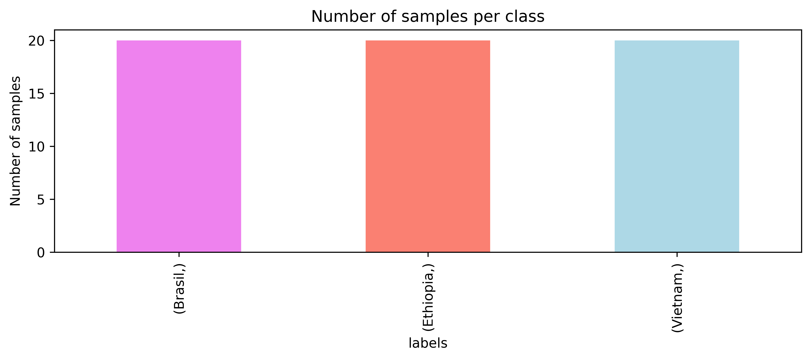
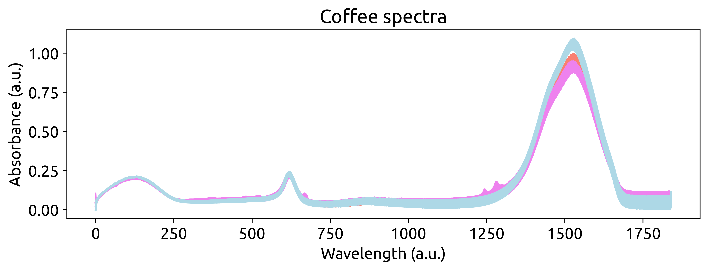
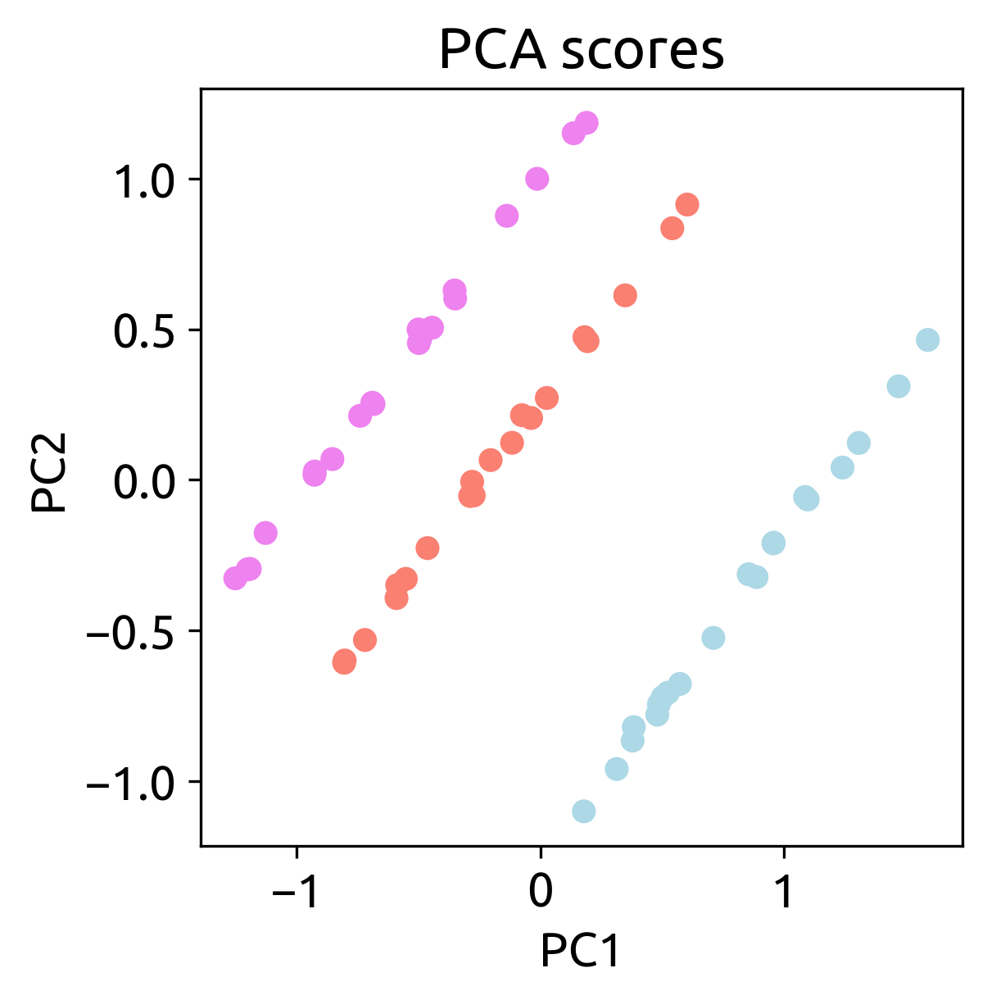
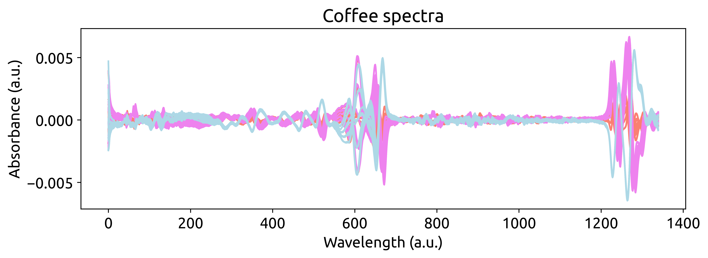

# __Coffee Spectra Classifier__


## What will you learn?

- [The coffee dataset](#the-coffee-dataset-🌍)
- [Importing the data](#importing-the-data)
- [Explore, plot and color](#explore-plot-and-color)
- [Exploring the data](#exploring-the-data-🤓)
- [Preprocessing the spectra](#preprocessing-the-spectra-🌊)
- [Modelling the data](#modelling-the-data)

## __Unlocking the Secrets of Coffee: A Spectral Journey ☕__

Welcome to a flavorful adventure in the world of data science and coffee! This guide will show you how to harness the power of machine learning, specifically Partial Least Squares Discriminant Analysis (PLS-DA), to unravel the fascinating story hidden within the spectra of three distinct coffees. Whether you're a coffee enthusiast, a data science aficionado, or simply curious about what can be discovered through the art of classification, this journey promises to be both intriguing and educational.

### __The Coffee Dataset 🌍__

Can you taste the difference between a coffee from Ethiopia, Brazil, or Vietnam? While your palate may offer some insights, we're about to dive deeper into the heart of coffee differentiation using the marvels of Infrared Spectroscopy (IR). Our dataset contains IR spectra of coffee samples originating from these three distinct coffee producing countries:

    🇪🇹 Ethiopia
    🇧🇷 Brazil
    🇻🇳 Vietnam 

These spectra have been meticulously collected from brewed coffee using Attenuated Total Reflectance Mid-Infrared Spectroscopy (ATR-MIR). In this guide, we'll walk you through the steps to create a classification model that can decipher the unique fingerprint of each coffee's origin from its spectral signature. It's not just about coffee; it's about the remarkable insights data science can bring to even the simplest pleasures of life.

So, grab your favorite coffee mug, prepare to delve into the world of data-driven discovery, and let's embark on this aromatic journey together! ☕🔍🧠

{: .highlight }
> Attention, coffee connoisseurs! Ever wondered if the essence of an espresso or the charm of a moka pot can be decoded through data? 🤔
> In our dataset, we've roasted all the coffee under the same conditions, but here's the twist: Ethiopian and Brazilian beans were transformed into espresso magic, while Spanish coffee embarked on a moka pot journey. ☕✨
>Prepare for an aromatic exploration where we use science and machine learning to uncover the secrets within these coffee spectra. Join us on this short, sweet, and caffeinated adventure! ☕🧬🚀


## __Importing the data__

Fantastic! Now that we've set the stage with our coffee dataset, it's time to take the plunge into the rich world of data analysis. No need to worry about complicated data wrangling – with ```chemotools``` we've made it effortless for you. We've gracefully loaded our coffee spectra into a sleek and ready-to-explore ```pandas.DataFrame```. Let's start brewing some data magic! ☕🔮📊. 


```python
from chemotools.datasets import load_coffee

spectra, labels = load_coffee()
```

The ```load_coffee()``` function returns two variables: ```spectra``` and ```labels```:

- ```spectra```: A ```pandas.DataFrame``` containing the spectra of the coffee samples as rows.
- ```labels```: A ```pandas.DataFrame``` containing the origin of each sample.

## __Explore, plot and color__

Before we delve deep into our coffee data analysis, let's quickly size up our datasets. Understanding their dimensions is our first step to uncovering insights. Let's get a snapshot of the data sizes and kickstart our analysis. Ready? Let's roll! ☕📏📊

```python
print(f"The spectra dataset has {spectra.shape[0]} samples")
print(f"The spectra dataset has {spectra.shape[1]} features")
```
which will return:

```bash
The spectra dataset has 60 samples
The spectra dataset has 1841 features
```

The ```spectra``` dataset contains 60 samples and 1841 features. Each sample is a spectrum, and each feature is a wavenumber. The ```labels``` dataset contains the origin of each sample. To analyze the ```labels``` dataset we can use the ```value_counts()``` method from ```pandas``` and make a bar plot.

```python
import matplotlib.pyplot as plt

fig, ax = plt.subplots(figsize=(10, 3))
labels.value_counts().plot.bar(color=['Violet', 'Salmon', 'LightBlue'])
ax.set_ylabel("Number of samples")
ax.set_title("Number of samples per class")
```



We have a balanced dataset with 20 samples per class. Now that we have a better understanding of our data, let's start plotting the spectra. ☕🔍📊

```python
# define a color dictionary for each origin
color_dict = {
    "Brasil": "Violet",
    "Ethiopia": "Salmon",
    "Vietnam": "LightBlue",
}

fig, ax = plt.subplots(figsize=(10, 3))
for i, row in enumerate(spectra.iterrows()):
    ax.plot(row[1].values, color=color_dict[labels.iloc[i].values[0]])

ax.set_xlabel("Wavelength (a.u.)")
ax.set_ylabel("Absorbance (a.u.)")
ax.set_title("Coffee spectra")
```



Visually, we can see that there are some differences between the spectra of the three coffees. However, we need to dig deeper to understand the differences between the spectra. Let's start by exploring the data. We can do that by using a Principal Component Analysis (PCA) to reduce the dimensionality of the data.

To do so, we will first mean center the data using the ```StandardScaler()``` preprocessing method from ```scikit-learn```. Then, we will use the ```PCA()``` method, also from ```scikit-learn```, to reduce the dimensionality of the data to two principal components. Finally, we will plot the two principal components and color them according to the origin of the coffee.

{: .highlight }
> When using spectroscopic data, we do not want to scale the spectra to unit variance. Instead, we want to mean center the data. This is because the variance of the spectra is related to the absorbance of the sample. If we scale the data to unit variance, we will lose the information about the absorbance of the sample. We can mean center the data using the ```StandardScaler()``` and setting the ```use_std``` argument to ```False```.

```python 
import pandas as pd

from sklearn.preprocessing import StandardScaler
from sklearn.decomposition import PCA

# standardize the data
spectra_scaled = StandardScaler(with_std=False).fit_transform(spectra)

# make a PCA object
pca = PCA(n_components=2)

# fit and transform the data
spectra_pca = pca.fit(spectra_scaled).transform(spectra_scaled)

# Make a dataframe with the PCA scores
spectra_pca_df = pd.DataFrame(
    data=spectra_pca, columns=["PC1", "PC2"], index=spectra.index
)

# Add the labels to the dataframe
spectra_pca_df = pd.concat([spectra_pca_df, labels], axis=1)

# Plot the PCA scores
fig, ax = plt.subplots(figsize=(4, 4))
ax.scatter(
    spectra_pca_df["PC1"],
    spectra_pca_df["PC2"],
    c=spectra_pca_df["labels"].map(color_dict),
)
ax.set_xlabel("PC1")
ax.set_ylabel("PC2")
ax.set_title("PCA scores")
```
<a href="link_to_image">
    
</a>

The results show that there are some differences between the spectra of the three coffes.

## __Preprocessing the spectra  🌊__
The objective of the preprocessing is to remove from the spectra non-chemical systematic variation, such as baseline shifts or scattering effects. There has been a lot of research on the preprocessing of spectroscopic data, and this is where ```chemotools``` becomes very handy: we harness the power of such research and make it available to you using  ```scikit-learn``` standards.

We will build the preprocessing steps in a pipeline using the ``` make_pipeline()``` method from ```sklearn.pipeline```. A [pipeline](https://paucablop.github.io/chemotools/get-started/scikit_learn_integration.html#working-with-pipelines) is a sequence of steps that are applied to the data in a given order. In our case, we will apply the following steps:

- __[Standard normal variate (SNV)](https://paucablop.github.io/chemotools/docs/scatter.html#standard-normal-variate)__ to remove scattering effects.

- __[Derivative](https://paucablop.github.io/chemotools/docs/derivative.html#savitzky-golay-derivative)__ to remove both additive and multiplicative scattering effects.

- __[Range cut](https://paucablop.github.io/chemotools/docs/variable_selection.html#range-cut)__ to select the most relevant wavenumbers.

- __[Standardize](https://scikit-learn.org/stable/modules/generated/sklearn.preprocessing.StandardScaler.html)__ remove the mean from the dataset.

```python
from sklearn.pipeline import make_pipeline
from sklearn.preprocessing import StandardScaler

from chemotools.derivative import SavitzkyGolay
from chemotools.scatter import StandardNormalVariate
from chemotools.variable_selection import RangeCut

pipeline = make_pipeline(
    StandardNormalVariate(),
    SavitzkyGolay(window_size=21, polynomial_order=1),
    RangeCut(start=10, end=1350),
    StandardScaler(with_std=False))

preprocessed_spectra = pipeline.fit_transform(spectra)
```

{: .note }
> Oh, this is cool! See how we are integrating chemometrics with ```scikit-learn```? ```StandardNormalVariate```, and ```SavitizkyGolay``` and ```RangeCut``` are all preprocessing techniques implemented in ```chemotools```, while ```StandardScaler``` and ```pipelines``` are functinlaities provided by ```scikit-learn```. This is the power of ```chemotools```, it is designed to work seamlessly with ```scikit-learn```.

Let's plot the preprocessed spectra to see the effect of the preprocessing steps.

```python
fig, ax = plt.subplots(figsize=(10, 3))
for i, spectrum in enumerate(preprocessed_spectra):
    ax.plot(spectrum, color=color_dict[labels.iloc[i].values[0]])
ax.set_xlabel("Wavelength (a.u.)")
ax.set_ylabel("Absorbance (a.u.)")
ax.set_title("Coffee spectra")
```



## __Modelling the data__
Now that we've finely tuned our dataset and unveiled its hidden facets, it's time to pour the magic of machine learning into our coffee journey. 🎩🔮🧙‍♂️

In this section, we'll dive into the art of modeling with the precision of a skilled barista. Our goal? To create a classification model that can distinguish the origins of our aromatic brews using their spectral signatures. ☕📊🔍. 

Partial Least Squares Discriminant Analysis (PLS-DA) is a simple statistical technique used for classification. PLS-DA models the relationship between input variables (spectral data) and class labels (coffee origins), allowing it to classify new samples based on their spectral signatures with high accuracy. It's a powerful tool for pattern recognition in complex datasets, making it ideal for our coffee origin classification. 

Before we start our PLS-DA algorithm, we need to encode the labels into numbers. We can do that using the ```LabelEncoder()``` method from ```scikit-learn```.

```python
from sklearn.preprocessing import LabelEncoder

# Make a LabelEncoder object
le = LabelEncoder()

# Fit the LabelEncoder object
le.fit(labels.values.ravel())

# Transform the labels
labels_encoded = le.transform(labels.values.ravel())
```

If we print the ```labels_encoded``` variable, we will see that the labels have been encoded into numbers.

```
array([1, 1, 1, 1, 1, 1, 1, 1, 1, 1, 1, 1, 1, 1, 1, 1, 1, 1, 1, 1, 0, 0,
       0, 0, 0, 0, 0, 0, 0, 0, 0, 0, 0, 0, 0, 0, 0, 0, 0, 0, 2, 2, 2, 2,
       2, 2, 2, 2, 2, 2, 2, 2, 2, 2, 2, 2, 2, 2, 2, 2])
```

Now that our coffee origin labels have been meticulously encoded into numerical values, we stand on the threshold of training our robust PLS-DA model. However, before we embark on this journey, it's a well-established practice in machine learning to divide our data into two distinct sets: one for training and one for testing. To accomplish this, we'll employ the trusted train_test_split() method from the scikit-learn library.

Our strategy is to allocate 80% of our dataset for training our model, allowing it to learn from the rich spectral data, while reserving the remaining 20% for testing. This division ensures that our model's performance can be rigorously evaluated on unseen data, a crucial step in assessing its real-world applicability and predictive power. 📊🔍🚀

```python
from sklearn.model_selection import train_test_split

X_train, X_test, y_train, y_test = train_test_split(
    preprocessed_spectra, labels_encoded, test_size=0.2, random_state=42
)
```

{: .note }
> We set the ```random_state``` argument to 42 to ensure reproducibility of the results.

Now that we have our training and testing sets, we can start building our PLS-DA model. We will use the ```PLSRegression()``` method from ```scikit-learn```. We will set the number of components to 2 and the ```scale``` argument to ```False```. This is because we have already scaled the data in the preprocessing step.

```python
from sklearn.cross_decomposition import PLSRegression

pls = PLSRegression(n_components=2)
pls.fit(X_train, y_train) # Train with train split
y_pred = pls.predict(X_test) # Test with test split
```
    
{: .note }
> We have chosen two components because from our PCA analysis we saw that using two components we can separate the three classes.

Now that we have trained our model, we can evaluate its performance. We will use the [```accuracy_score()```](https://scikit-learn.org/stable/modules/generated/sklearn.metrics.accuracy_score.html) and the [```confusion_matrix()```](https://scikit-learn.org/stable/modules/generated/sklearn.metrics.confusion_matrix.html) methods from ```scikit-learn``` to evaluate the performance of the model.

```python
from sklearn.metrics import accuracy_score, confusion_matrix

print("Accuracy: ", accuracy_score(y_test, y_pred.round()))
print("Confusion matrix: \n", confusion_matrix(y_test, y_pred.round()))
```
```
>Accuracy: 1.0
>Confusion matrix: 
 [[7 0 0]
 [0 4 0]
 [0 0 9]]
```

In the enchanting world of coffee spectra and data-driven exploration, our journey has culminated in a remarkable achievement – a great confusion matrix. Like a barista crafting the ideal brew, our PLS-DA model has achieved an unprecedented level of precision, effortlessly discerning the origins of our beloved coffees. As we savor this moment, let it remind us that within the wavelengths and data points lies the potential to unlock the mysteries of our world. With data as our guide, we've brewed a remarkable cup of insights. Here's to the endless possibilities that lie ahead in the world of data analysis!" ☕🔍📊🌟

## __Recap__

- __The Coffee Dataset:__ Explore the unique world of coffee differentiation through Infrared Spectroscopy. This dataset contains IR spectra of coffee samples from Ethiopia, Brazil, and Vietnam.

- __Importing the Data:__ Effortlessly load the coffee spectra into a Pandas DataFrame using chemotools, making data analysis a breeze.

- __Explore, Plot, and Color:__ Gain insights into the dataset's size and composition, showcasing its 60 samples and 1841 features. Visualize the data with colorful coffee spectra plots.

- __Preprocessing the Spectra:__ Dive into the world of preprocessing, where chemotools comes into play. Eliminate non-chemical systematic variations using techniques like Standard Normal Variate (SNV), Derivative, Range Cut, and Standardization.

- __Modelling the Data:__ Enter the realm of machine learning with Partial Least Squares Discriminant Analysis (PLS-DA), a powerful tool for classification. Encode labels into numerical values and split the data into training and testing sets. Train the model and evaluate its performance, achieving an impressive confusion matrix.

This tutorial showcases the beauty of data science and chemistry, bringing the art of coffee classification to life within the rich world of spectral data.


