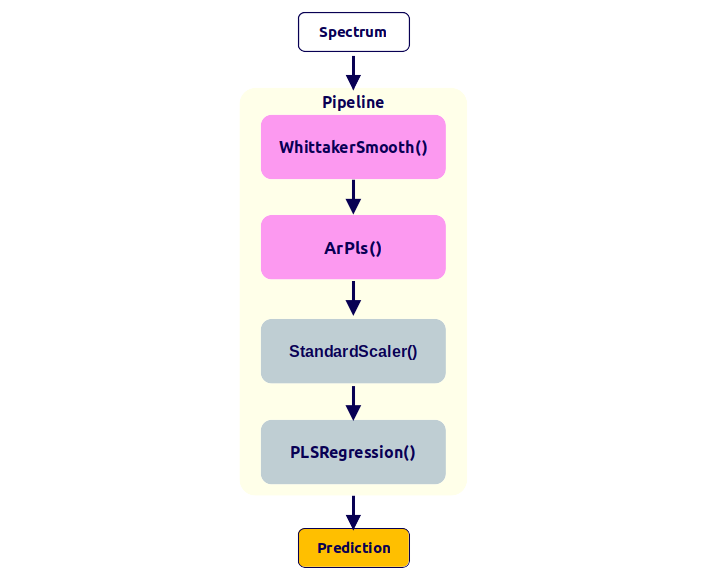

# __Scikit-learn integration__

This page shows how to use ```chemotools``` in combination with ```scikit-learn```. The following topics are covered:

- [Working with single spectra](#working-with-single-spectra)
- [Working with pipelines](#working-with-pipelines)
- [Working with pandas DataFrames](#working-with-pandas-dataframes)
- [Persisting your models](#persisting-your-models)

## __Working with single spectra__
Preprocessing techniques in ```scikit-learn``` are primarily designed to work with 2D arrays, where each row represents a sample and each column represents a feature (i.e., matrices). However, in spectroscopy, single spectra are often of interest, which are represented as 1D arrays (i.e., vectors). Below there is an example of a single spectrum:

```bash
array([0.484434, 0.485629, 0.488754, 0.491942, 0.489923, 0.492869,
        0.497285, 0.501567, 0.500027, 0.50265 ])
```

To apply ```scikit-learn``` and ```chemotools``` techniques to single spectra, they need to be reshaped into 2D arrays (i.e., a matrix with one row). To achieve this, you can use the following code that reshapes a 1D array into a 2D array with a single row:

```python
import numpy as np
from chemotools.scatter import MultiplicativeScatterCorrection

msc = MultiplicativeScatterCorrection()
spectra_msc = msc.fit_transform(spectra.reshape(1, -1))
```
The ```.reshape(1, -1)``` method is applied to the 1D array ```spectra```, which is converted into a 2D array with a single row. An example of the output of the ```.reshape(1, -1)``` method is shown below:

```bash
array([[0.484434, 0.485629, 0.488754, 0.491942, 0.489923, 0.492869,
         0.497285, 0.501567, 0.500027, 0.50265 ]])
```

{: .highlight }
> The output of the ```.reshape(1, -1)``` method is a 2D array with a single row. This is the format that ```scikit-learn``` and ```chemotools``` preprocessing techniques expect as input.

## __Working with pipelines__
Pipelines are becoming increasingly popular in machine learning workflows. In essence, pipelines are a sequence of connected data processing steps, where the output of one step is the input of the next. They are very useful for:

- automating complex workflows, 
- improving efficiency, 
- reducing errors in data processing and analysis and
- simplifying model persistence and deployment.

All preprocessing techniques in ```chemotools``` are compatible with ```scikit-learn``` and can be used in pipelines. As an example, we will study the case where we would like to apply the following preprocessing techniques to our spectra:

- Whittaker smoothing
- ArPls baseline correction
- Mean centering
- PLS regression

In a traditional workflow, would apply each preprocessing technique individually to the spectra as shown in the image below:

[](figures/no-pipeline.png)

The code to perform this workflow would look like this:

```python
from sklearn.cross_decomposition import PLSRegression
from sklearn.preprocessing import StandardScaler

from chemotools.baseline import ArPls
from chemotools.smooth import WhittakerSmooth

# Whittaker smoothing
spectra_smoothed = WhittakerSmooth().fit_transform(spectra)

# ArPls baseline correction
spectra_baseline = ArPls().fit_transform(spectra_smoothed)

# Mean centering
spectra_centered = StandardScaler(with_mean=True, with_std=False).fit_transform(spectra_baseline)

# PLS regression
pls = PLSRegression(n_components=2)
pls.fit(spectra_centered, reference)
prediction = pls.predict(spectra_centered)
```

This is a tedious and error-prone workflow, especially when the number of preprocessing steps increases. In addition, persisting the model and deploying it to a production environment is not straightforward, as each preprocessing step needs to be persisted and deployed individually.

A better approach is to use a pipeline, which automates the workflow and reduces the risk of errors. The figure below shows the same workflow as above, but using a pipeline:

[](figures/pipeline.png)

The code to perform this workflow would look like this:

```python
from sklearn.cross_decomposition import PLSRegression
from sklearn.pipeline import make_pipeline
from sklearn.preprocessing import StandardScaler

from chemotools.baseline import ArPls
from chemotools.smooth import WhittakerSmooth

pipeline = make_pipeline(
    WhittakerSmooth(),
    ArPls(),
    StandardScaler(with_std=False),
    PLSRegression(n_components=2)
)
```
Now the pipeline can be visualized, which will show the sequence of preprocessing techniques that will be applied in the pipeline and their parameters:

<iframe src="figures/pipeline_visual.html" width="100%" style="border: none;"></iframe>

Once the pipeline is created, it can be used to fit and transform the spectra and to make predictions:

```python
prediction = pipeline.fit(spectra, reference).predict(spectra)
```

The preprocessed spectra produced by the previous pipeline is shown in the figure below.

<iframe src="figures/pipeline.html" width="800px" height="500px" style="border: none;"></iframe>


{: .highlight }
> Notice that in the traditional workflow, the different preprocessing objects had to be persisted individually. In the pipeline workflow, the entire pipeline can be persisted and deployed to a production environment. See the [Persisting your models](#persisting-your-models) section for more information.


## __Working with pandas DataFrames__
For the ```pandas.DataFrame``` lovers. By default, all ```scikit-learn``` and ```chemotools``` transformers output ```numpy.ndarray```. However, now it is possible to configure your ```chemotools``` preprocessing methods to produce ```pandas.DataFrame``` objects as output. This is possible after implementing the new ```set_output()``` API from ```scikit-learn```>= 1.2.2 ([documentation](https://scikit-learn.org/stable/auto_examples/miscellaneous/plot_set_output.html)). The same API implemented in other ```scikit-learn``` preprocessing methods like the ```StandardScaler()``` is now available for the ```chemotools``` transformers. 

{: .warning }
> Right now, the ```set_output()``` API is not available for the ```RangeCut()``` method. This is because the ```RangeCut()``` method changes the names of the columns in the input array, which is not compatible with the ```set_output()``` API from ```scikit-learn```. We will look to fix this in future releases.

Below there are two examples of how to use this new API:

### __Example 1: Using the ```set_output()``` API with a single preprocessing method__

#### __1. Load your spectral data as a ```pandas.DataFrame```.__

First load your spectral data. In this case we assume a file called ```spectra.csv``` where each row represents a spectrum and each column represents a wavenumbers.

```python
import pandas as pd
from chemotools.baseline import AirPls

# Load your data as a pandas DataFrame
spectra = pd.read_csv('data/spectra.csv', index_col=0)
```

The ```spectra``` variable is a ```pandas.DataFrame``` object with the indices representing the sample names and the columns representing the wavenumbers. The first 5 rows of the ```spectra``` DataFrame look like this:

|    |    900.0 |    901.0 |    903.0 |    904.0 |    905.0 |    906.0 |    908.0 |    909.0 |    910.0 |
|---:|---------:|---------:|---------:|---------:|---------:|---------:|---------:|---------:|---------:|
|  0 | 0.246749 | 0.268549 | 0.279464 | 0.280701 | 0.292982 | 0.288912 | 0.297167 | 0.310435 | 0.325145 |
|  1 | 0.235092 | 0.249278 | 0.25094  | 0.251326 | 0.266078 | 0.263885 | 0.279901 | 0.295895 | 0.297663 |
|  2 | 0.227894 | 0.223541 | 0.226005 | 0.23621  | 0.249276 | 0.26032  | 0.258642 | 0.282584 | 0.285163 |
|  3 | 0.204115 | 0.213624 | 0.220228 | 0.222264 | 0.225996 | 0.232336 | 0.235273 | 0.261938 | 0.26663  |
|  4 | 0.195615 | 0.195829 | 0.203789 | 0.220114 | 0.233223 | 0.240248 | 0.246378 | 0.261398 | 0.267355 |


#### __2. Create a ```chemotools``` preprocessing object and set the output to ```pandas```.__

Next, we create the ```AirPls``` object and set the output to ```pandas```.

```python
# Create an AirPLS object and set the output to pandas
airpls = AirPls().set_output(transform='pandas')
```
The ```set_output()``` method accepts the following arguments:

- ```transform```: The output format. Can be ```'pandas'``` or ```'default'``` (the default format will output a ```numpy.ndarray```).


#### __3. Fit and transform the spectra__

```python
# Fit and transform the spectra
spectra_airpls = airpls.fit_transform(spectra)
```

The output of the ```fit_transform()``` method is now a ```pandas.DataFrame``` object. 

{: .highlight }
> Notice that by default the indices and the columns of the input data are not maintained to the output, and the ```spectra_airpls``` DataFrame has default indices and columns (see example below).

The ```spectra_airpls``` DataFrame has the following structure:

|    |       x0 |       x1 |       x2 |       x3 |       x4 |       x5 |       x6 |       x7 |       x8 |       x9 |
|---:|---------:|---------:|---------:|---------:|---------:|---------:|---------:|---------:|---------:|---------:|
|  0 | 0.210838 | 0.213002 | 0.217275 | 0.222833 | 0.229342 | 0.236683 | 0.245315 | 0.254254 | 0.263244 | 0.272121 |
|  1 | 0.219816 | 0.220637 | 0.223478 | 0.227481 | 0.233518 | 0.240035 | 0.247666 | 0.256066 | 0.264704 | 0.273879 |
|  2 | 0.220096 | 0.221503 | 0.224515 | 0.22905  | 0.23486  | 0.242032 | 0.250077 | 0.25948  | 0.268111 | 0.276561 |
|  3 | 0.211932 | 0.213675 | 0.216953 | 0.222211 | 0.22891  | 0.235941 | 0.243654 | 0.252518 | 0.261452 | 0.270276 |
|  4 | 0.212528 | 0.21408  | 0.217522 | 0.222005 | 0.228657 | 0.236576 | 0.244935 | 0.253593 | 0.262239 | 0.271826 |

### __Example 2: Using the ```set_output()``` API with a pipeline__

Similarly, the ```set_output()``` API can be used with pipelines. The following code shows how to create a pipeline that performs:

- Multiplicative scatter correction
- Standard scaling

```python
import pandas as pd
from sklearn.pipeline import make_pipeline
from sklearn.preprocessing import StandardScaler
from chemotools.scatter import MultiplicativeScatterCorrection

pipeline = make_pipeline(MultiplicativeScatterCorrection(),StandardScaler())
pipeline.set_output(transform="pandas")

output = pipeline.fit_transform(spectra)
```

## __Persisting your models__

In the previous sections, we saw how to use ```chemotools``` in combination with ```scikit-learn``` to preprocess your data and make predictions. However, in a real-world scenario, you would like to persist your preprocessing pipelines and models to deploy it to a production environment. In this section, we will show two ways to persist your models:

- Using ```pickle```
- Using ```joblib```

For this section, we will use the following fit pipeline as an example:

```python
from chemotools.scatter import MultiplicativeScatterCorrection
from chemotools.baseline import AirPls
from sklearn.cross_decomposition import PLSRegression
from sklearn.pipeline import make_pipeline
from sklearn.preprocessing import StandardScaler

# create pipeline
pipeline = make_pipeline(
    MultiplicativeScatterCorrection(),
    AirPls(),
    StandardScaler(with_std=False),
    PLSRegression(n_components=2)
)

# fit pipeline
pipeline.fit(spectra, reference)
```

### __Using ```pickle```__

```pickle``` is a Python module that implements a binary protocol for serializing and de-serializing a Python object structure. It is a standard module that comes with the Python installation. The following code shows how to persist a ```scikit-learn``` model using ```pickle```:

{: .warning }
> Notice that the ```pickle``` module is not secure against erroneous or maliciously constructed data. Never unpickle data received from an untrusted or unauthenticated source.

```python
import pickle

# persist model
filename = 'model.pkl'

with open(filename, 'wb') as file:
    pickle.dump(pipeline, file)

# load model
with open(filename, 'rb') as file:
    pipeline = pickle.load(file)
```

### __Using ```joblib```__

[```joblib```](https://joblib.readthedocs.io/en/stable/) is a Python module that provides utilities for saving and loading Python objects that make use of NumPy data structures, efficiently. It is not part of the standard Python installation, but it can be installed using ```pip```. The following code shows how to persist a ```scikit-learn``` model using ```joblib```:

```python
from joblib import dump, load

# persist model
filename = 'model.joblib'

with open(filename, 'wb') as file:
    dump(pipeline, file)

# load model
with open(filename, 'rb') as file:
    pipeline = load(file)
```


