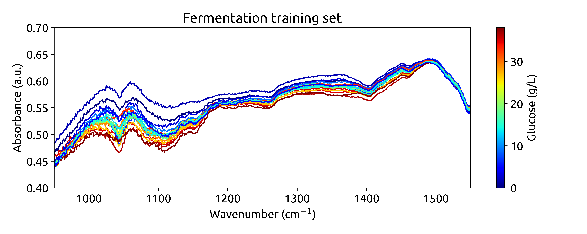
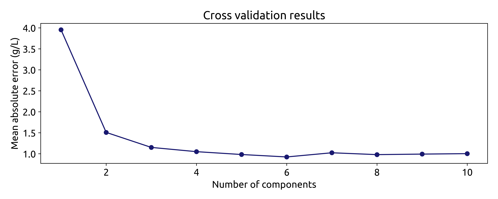

# __Training a regression model__

## What will you learn?

- [Get familiar with the Fermentation dataset](#introduction)
- [Load the fermentation dataset](#loading-the-training-dataset)
- [Explore the fermentation dataset](#exploring-the-training-dataset)
- [Visualize the fermentation dataset](#visualizing-the-training-dataset)
- [Preprocess the training spectra](#preprocessing-the-training-spectra)

## __Introduction__
Welcome to the world of spectroscopic data analysis, where we provide you with a unique insight into lignocellulosic ethanol fermentation in real-time. Our dataset comprises spectra obtained through attenuated total reflectance, mid-infrared (ATR-MIR) spectroscopy, combined with high-performance liquid chromatography (HPLC) reference data to ensure precision and accuracy.

Within this project, you'll find two vital datasets:

- __Training Dataset:__ This extensive resource includes both spectral data and corresponding HPLC measurements, serving as the foundation of our analysis.

- __Testing Dataset:__ Immerse yourself in the fermentation process through a time series of real-time spectra. For a comprehensive view, we've also included off-line HPLC measurements.

For a deeper understanding of these datasets and their transformation of raw data into actionable insights, please refer to our comprehensive article: "Transforming Data to Information: A Parallel Hybrid Model for Real-Time State Estimation in Lignocellulosic Ethanol Fermentation." It's a journey into the world of data analysis, offering real-world applications.

{: .note }
> This is a step by step guide, that you should be able to run on your own computer. Just remember to install the ```chemotools``` package first using ```pip install chemotools```.

## __Loading the training dataset__
The Fermentation dataset is a valuable resource for investigating lignocellulosic ethanol fermentation. You can access it through the chemotools.datasets module using the ```load_fermentation_train()``` function:

```python
from chemotools.datasets import load_fermentation_train

spectra, hplc = load_fermentation_train()
```

The ```load_fermentation_train()``` function returns two ```pandas.DataFrame```:

- ```spectra```: This dataset contains spectral data, with columns representing wavenumbers and rows representing samples.

- ```hplc```: AHere, you'll find HPLC measurements, specifically glucose concentrations (in g/L), stored in a single column labeled ```glucose```.

## __Exploring the training dataset__

Before diving into data modeling, it's essential to get familiar with your data. Start by answering basic questions: _How many samples are there?_, and _how many wavenumbers are available?_

```python
print(f"Number of samples: {spectra.shape[0]}")
print(f"Number of wavenumbers: {spectra.shape[1]}")
```
This should return the following output:

```
Number of samples: 21
Number of wavenumbers: 1047
```

Now that you have the basics down, let's take a closer look at the data.

For the spectral data, you can use the ```pandas.DataFrame.head()``` method to examine the first 5 rows:

```python
spectra.head()
```

For brevity, we won't display the entire table here, but you'll notice that each column corresponds to a wavenumber, and each row represents a sample.

Turning to the HPLC data, the ```pandas.DataFrame.describe()``` method provides a summary of the glucose column:

```python
hplc.describe()
```

This summary offers insights into the distribution of glucose concentrations. With this practical knowledge, you're ready to embark on your data exploration journey.

|           | Glucose      |
|-----------|--------------|
| Count     | 21.000000    |
| Mean      | 19.063895    |
| Std       | 12.431570    |
| Min       | 0.000000     |
| 25%       | 9.057189     |
| 50%       | 18.395220    |
| 75%       | 29.135105    |
| Max       | 38.053004    |


## __Visualizing the training dataset__

To better understand our dataset, we employ visualization. We will plot the train dataset, with each spectrum color-coded to reflect its associated glucose concentration. This visual approach provides a didactic means to grasp the dataset's characteristics, offering insights into chemical variations among the samples. To do so, we'll use the ```matplotlib.pyplot``` module. Remember to install it first using ```pip install matplotlib```.

Up until now, we have used ```pandas.DataFrame``` to represent the dataset. ```pandas.DataFrame``` are great for storing and manipulating many large datasets. However, I often find more convenient to use ```numpy.ndarray``` to work with spectral data. Therefore, we will convert the ```pandas.DataFrame``` to ```numpy.ndarray``` using the ```pandas.DataFrame.to_numpy()``` method.

{: .note }
> Pandas lover 🐼 ❤️? No problem! ```chemotools``` also supports working with ```pandas.DataFrame``` by implementing the latest ```set_output()``` API from ```scikit-learn```. If you are more interested in working with ```pandas```, take a look at the documentation [here](https://paucablop.github.io/chemotools/get-started/scikit_learn_integration.html#working-with-pandas-dataframes).

So our first step will be to transform our ```pandas.DataFrame``` to ```numpy.ndarray```:

```python
import numpy as np

# Convert the spectra pandas.DataFrame to numpy.ndarray
spectra_np = spectra.to_numpy()

# Convert the wavenumbers pandas.columns to numpy.ndarray
wavenumbers = spectra.columns.to_numpy(dtype=np.float64)

# Convert the hplc pandas.DataFrame to numpy.ndarray
hplc = hplc.to_numpy()
```

Now that we have our data in the right format, we can start plotting. We will define a function to plot the spectra, where each spectrum will be color-coded according to its glucose concentration. We will use the ```matplotlib.colors.Normalize``` class to normalize the glucose concentrations between 0 and 1. Then, we will use the ```matplotlib.cm.ScalarMappable``` class to create a colorbar.


```python
import matplotlib.pyplot as plt
from matplotlib.colors import Normalize

def plot_spectra(spectra: np.ndarray, wavenumbers: np.ndarray, hplc: np.ndarray):
    # Define a colormap
    cmap = plt.get_cmap("jet")

    # Define a normalization function to scale glucose concentrations between 0 and 1
    norm = Normalize(vmin=hplc.min(), vmax=hplc.max())
    colors = [cmap(normalize(value)) for value in hplc]

    # Plot the spectra
    fig, ax = plt.subplots(figsize=(10, 4))
    for i, row in enumerate(spectra):
        ax.plot(wavenumbers, row, color=colors[i])

    # Add a colorbar
    sm = plt.cm.ScalarMappable(cmap=cmap, norm=normalize)
    sm.set_array([])
    fig.colorbar(sm, ax=ax, label='Glucose (g/L)')

    # Add labels
    ax.set_xlabel('Wavenumber (cm$^{-1}$)')
    ax.set_ylabel('Absorbance (a.u.)')
    ax.set_title('Fermentation training set')

    plt.show()
```

Then, we can use this function to plot the training dataset:

```python
plot_spectra(spectra, hplc)
```

which should result in the following plot:


Ok, these are not very beautiful spectra. This is because they are recorded over a long wavenumber range, where there is a large section withoug chemical information. Let's zoom in on the region between 950 and 1550 cm$^{-1}$, where we can see some interesting features:



## __Preprocessing the training spectra__

Now that you've explored the dataset, it's time to preprocess the spectral data. This step is essential for removing unwanted variations, such as baseline shifts and noise, which can negatively impact model performance. We'll use the ```chemotools``` and the ```scikit-learn``` modules to preprocess the spectral data. 

We will preprocess the spectra using the following steps:

- __[Range Cut](https://paucablop.github.io/chemotools/docs/variable_selection.html#range-cut)__: to remove the wavenumbers outside the range between 950 and 1550 cm-1.

- __[Linear Correction](https://paucablop.github.io/chemotools/docs/baseline.html#linear-baseline-correction)__: to remove the linear baseline shift. 

- __[Savitzky-Golay](https://paucablop.github.io/chemotools/docs/derivative.html#savitzky-golay-derivative)__: calculates the nth order derivative of the spectra using the Savitzky-Golay method. This is useful to remove additive and multiplicative scatter effects. 

- __[Standard Scaler](https://scikit-learn.org/stable/modules/generated/sklearn.preprocessing.StandardScaler.html)__: to scale the spectra to zero mean.

We will chain the preprocessing steps using the [```make_pipeline()```](https://scikit-learn.org/stable/modules/generated/sklearn.pipeline.make_pipeline.html) function from ```scikit-learn```. _What is a pipeline?_ A pipeline is a sequence of steps that are executed in a specific order. In our case, we will create a pipeline that will execute the preprocessing steps in the order described above. You can find more information on working with pipelines at our [documentation page](https://paucablop.github.io/chemotools/get-started/scikit_learn_integration.html#working-with-pipelines).


```python
from chemotools.variable_selection import RangeCut
from chemotools.baseline import LinearCorrection
from chemotools.derivative import SavitzkyGolay

from sklearn.preprocessing import StandardScaler
from sklearn.pipeline import make_pipeline

# create a pipeline that scales the data
preprocessing = make_pipeline(
    RangeCut(start=950, end=1500, wavelength=wavenumbers),
    LinearCorrection(),
    SavitzkyGolay(window_size=15, polynomial_order=2, derivate_order=1),
    StandardScaler(with_std=False)
)
```

Now we can use the preprocessing pipeline to preprocess the spectra:

```python
spectra_preprocessed = preprocessing.fit_transform(spectra_np)
```

Finally, we can plot the preprocessed spectra:

```python
# get the wavenumbers after the range cut
start_index = preprocessing.named_steps['rangecut'].start
end_index = preprocessing.named_steps['rangecut'].end
wavenumbers_cut = wavenumbers[start_index:end_index]

# plot the preprocessed spectra
plot_spectra(spectra_preprocessed, wavenumbers_cut, hplc_np)

```
This will produce the following plot:


{: .note }
> Ok, this is cool! See how we are integrating chemometrics with ```scikit-learn```? ```RangeCut```, ```LinearCorrection``` and ```SavitizkyGolay``` are all preprocessing techniques implemented in ```chemotools```, while ```StandardScaler``` and ```pipelines``` are functinlaity provided by ```scikit-learn```. This is the power of ```chemotools```, it is designed to work seamlessly with ```scikit-learn```.


## __Training a PLS model__
A [Partial Least Squares (PLS)](https://en.wikipedia.org/wiki/Partial_least_squares_regression) model is a bilinear regression model that is widely used in chemometrics. It is a regression algorithm that will learn a latent space representation of the data that has a maximum covariance with the target variable. A crucial parameter of the PLS model is the dimension of the latent space (often referred to as number of components). Selecting a number of components that is too large, will result in overfitting, as the latent space will start describing the noise in the data. On the other hand, selecting a number of components that is too small, will result in underfitting, as the latent space will not be able to capture the relevant information in the data. Therefore, it is important to select the right number of components.

Finding the right number of components can be challenging, specially when the number of samples is not so large. For this reason, a powerfull tool to select the number of components is cross-validation. Cross-validation is a technique that allows us to estimate the generalization error of a model. The idea is to split the data into a training and a validation set. Then, we train the model on the training set and evaluate its performance on the validation set. We repeat this process several times, each time using a different split of the data. Finally, we average the performance of the model over all the splits. This will give us an estimate of the generalization error of the model. 

We will use the cross-validation functionalities provided by ```scikit-learn``` to find the optimal numbers of components for our PLS model. We will use the ```GridSearchCV``` class to perform a grid search over the number of components. The ```GridSearchCV``` class will perform a cross-validation for each number of components in the grid and return the optimal number of components.

```python
# import the PLSRegression and GridSearchCV classes
from sklearn.cross_decomposition import PLSRegression
from sklearn.model_selection import GridSearchCV

# instanciate a PLSRegression object
pls = PLSRegression(scale=False)

# define the parameter grid (number of components to evaluate)
param_grid = {'n_components': [1, 2, 3, 4, 5, 6, 7, 8, 9, 10]}

# create a grid search object
grid_search = GridSearchCV(pls, param_grid, cv=10, scoring='neg_mean_absolute_error')

# fit the grid search object to the data
grid_search.fit(spectra_preprocessed, hplc_np)

# print the best parameters and score
print("Best parameters: ", grid_search.best_params_)
print("Best score: ", np.abs(grid_search.best_score_))
```

This returns the following output:

```
Fitting 10 folds for each of 10 candidates, totalling 100 fits
Best parameters:  {'n_components': 6}
Best score:  0.9229440262462993
```

Suggesting that the optimal number of components is 6, with a mean absolute error of 0.92 g/L. We can verify this by plotting the mean absolute error as a function of the number of components:

```python
fig, ax = plt.subplots(figsize=(10, 4))
ax.plot(param_grid['n_components'], np.abs(grid_search.cv_results_['mean_test_score']), marker='o', color='b')
ax.set_xlabel('Number of components')
ax.set_ylabel('Mean absolute error (g/L)')
ax.set_title('Cross validation results')
```
which produces the following plot:




