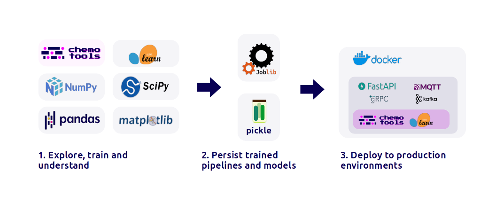

# Summary

```chemotools``` stands as a production-oriented versatile Python library, developed to provide a unified platform for advancing *chemometric* model development. Integrating spectral preprocessing methodologies with the ```scikit-learn``` API and the expansive Python machine learning ecosystem, this library seeks to standardize and simplify the complex process of creating and implementing robust *chemometric* and machine learning models of spectral data. 

# Statement of need

Spectroscopy comprises a group of several analytical techniques used to understand the composition of materials using light. Traditionally, spectroscopic data is analyzed by a discipline called *chemometrics*, a branch of machine learning specialized on extracting chemical information from multivariate spectra. Over the last decades, *chemometricians*, have excelled by developing advanced preprocessing methods designed to attenuate instrument and measuring artifacts from the spectra, enhancing the pure chemical information of the samples [@RINNAN20091201], [@MISHRA2020116045]. 

Spectroscopic methods are very suited for a wide range of applications because they allow analyzing the chemical properties of various samples in a fast and simple manner. For this reason, their adoption as integral components of Process Analytical Technology (PAT) has witnessed significant growth across industries, including chemical, biotech, food, and pharmaceuticals. Despite this surge, a notable obstacle has been the absence of open-source standardized, accessible toolkit for *chemometric* model development and deployment. ```chemotools```, positioned as a comprehensive solution, addresses this void by integrating into the Python machine learning ecosystem. By implementing a variety of preprocessing and feature selection tools with the ```scikit-learn``` API [@pedregosa2018scikitlearn], ```chemotools``` opens up the entire ```scikit-learn``` toolbox to users, encompassing features such as:

- a rich collection of estimators for regression, classification, and clustering
- cross-validation and hyper-parameter optimization algorithms
- pipelining for efficient workflows
- and model persistence to standardized files such as ```joblib``` or ```pickle```

This integration empowers users with a versatile array of tools for robust model development and evaluation (\autoref{fig:1}).

In addition to its foundational capabilities, ```chemotools``` not only enables users to preprocess data and train models using ```scikit-learn``` but also streamlines the transition of these models into a production setting. By enabling users with a well defined interface, ```chemotools``` facilitates the reception of input data and delivery of predictions from the trained model. This can then be containerized using Docker, providing an efficient means for the distribution and implementation of the model in any Docker-compatible environment, facilitating the deployment of models to cloud environments. This adaptive capability not only enables organizations to scale model usage but also allows them to monitor performance and promptly update or rollback the model as necessary.

```chemotools``` also introduces a practical innovation by providing a streamlined framework for data augmentation of spectroscopic datasets through the ```scikit-learn``` API. This feature offers users a straightforward and consistent method to enhance spectral datasets, by introducing stochastic artifacts that represent real-world variations. By integrating data augmentation into the *chemometric* workflow, ```chemotools``` provides users with an efficient tool for refining and their datasets generalizing the models and optimizing their performance. 





# Features and functionality

```chemotools``` implements a collection of ```scikit-learn``` transformers and selectors. Transformers are divided in preprocessing and augmentation methods. Preprocessing functions range from well-established *chemometric* methods such as the multiplicative scatter correction or the standard normal variate [@RINNAN20091201], to more recent methods such as the asymmetrically reweighed penalized least squares method to remove complex baselines [@arpls2]. Several preprocessing methods can be conveniently concatenated using ```scikit-learn``` pipelines (\autoref{fig:2}). An example of code used to create a preprocessing pipelines mixing ```scikit-learn``` and ```chemotools``` methods is shown in below:


```python
from chemotools.baseline import ArPls
from chemotools.smooth import WhittakerSmooth

from sklearn.pipeline import make_pipeline
from sklearn.preprocessing import StandardScaler


pipeline = make_pipeline(
    WhittakerSmooth(),
    ArPls(),
    StandardScaler(with_std=False),
)
```

The data augmentation module contains transformers that introduce stochastic artifacts to the spectral data to reflect real-world variability (e.g. instrument-to-instrument variations). These include a variety of transformers ranging from adding noise to the spectra following a given distribution, to shifts on the spectral peaks or changes on the intensity of the peaks. Since the data augmentation functions are implemented as transformers, the user can leverage the pipelining functions of ```scikit-learn``` to concatenate different augmentation methods in pipelines to transform their data. An example of an augmentation pipeline is shown in \autoref{fig:2}. An example of code to create an augmentation pipeline is shown below: 


```python
from chemotools.augmentation import BaselineShift, IndexShift, NormalNoise
from sklearn.pipeline import make_pipeline

augmentation_pipeline = make_pipeline(
    NormalNoise(scale=0.001),
    BaselineShift(0.001),
    IndexShift(3),
)

spectra_augmented = np.array([augmentation_pipeline.fit_transform(spectrum) for _ in range(5)])
```

\autoref{fig:3} shows five spectra augmented with the pipeline depicted in \autoref{fig:2} and the original spectrum.


In addition to the transformers, ```chemotools``` also implements selectors. Selectors are mathematical functions used to select the relevant features from the spectral dataset based on a given criteria. Selectors are used to select the features that contain the chemical information of the sample, making the models more robust and generalizable.

Beyond its mathematical prowess, ```chemotools``` goes a step further by providing real-world spectral datasets [@cabaneros1]. Accompanied by guides demonstrating the integration of scikit-learn and ```chemotools``` for training regression and classification models, these datasets immerse learners in practical applications. This hands-on approach bridges theoretical concepts and real-world implementation, nurturing a deeper understanding of potential challenges in real-world scenarios.

For those seeking detailed insights, the documentation page (https://paucablop.github.io/chemotools/) meticulously outlines all available mathematical functions within chemotools. This comprehensive resource serves as a guide for users exploring the extensive capabilities of the library.

# Adoption and applications

The ultimate objective of developing *chemometric* and machine learning models is either to gain insights about complex datasets and/or to train models that can be used in production applications (\autoref{fig:4}). From a research and development perspective, ```chemotools``` offers a wide range of transformers and selectors that, combined with the rest of the Python machine learning environment, enables researchers to investigate and understand their spectral datasets. From an industrial point of view, ```chemotools``` allows users to streamline the deployment of their trained models into production environments adhering to the frameworks developed by the machine learning community in Python (\autoref{fig:1}).  

Beyond its practical applications, ```chemotools``` has being utilized as an educational tool at universities for both Master's (MSc) and Doctoral (PhD) levels. Its incorporation into academic curricula provides a valuable way to enable the students to benefit from hands-on experience on real-world datasets gaining practical insights into the application of sophisticated techniques for preprocessing and analyzing spectral data. The tool's user-friendly interface, coupled with comprehensive documentation, has proven and enriching learning experience for students pursuing higher education in fields related to analytical chemistry and *chemometrics*.


# Author contribution statement

Conceptualization, coding, developing and paper writing by Pau Cabaneros Lopez.

# Acknowledgements

This project has not received any external funding. The author would like to express his gratitude to Dr. Vitor Hugo da Silva for his thorough feedback on the manuscript.

# References


